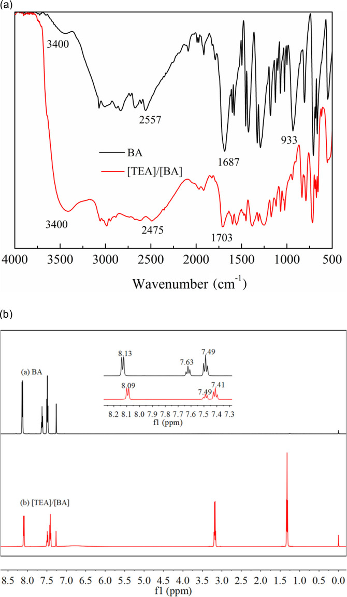
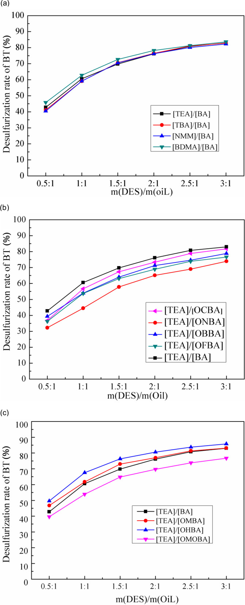
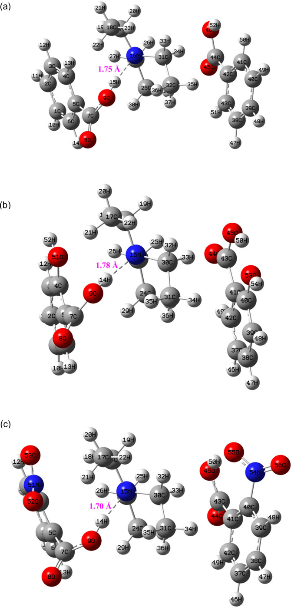
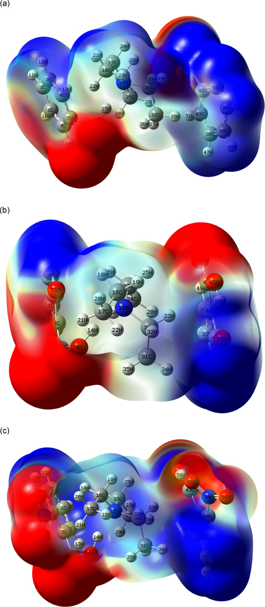
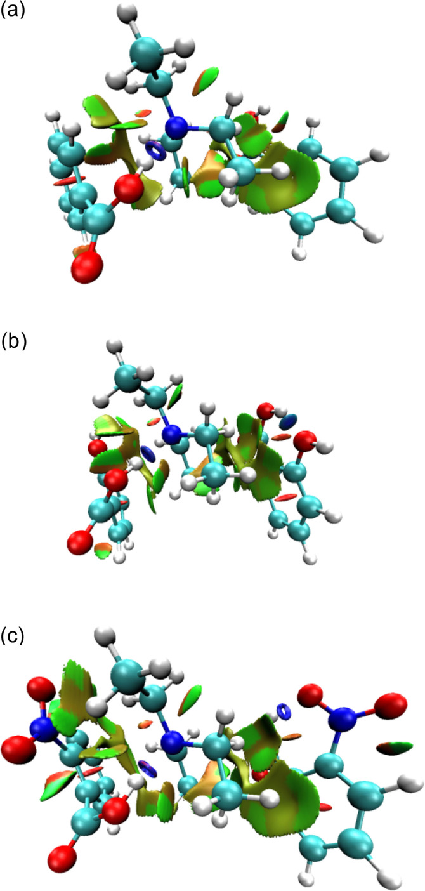
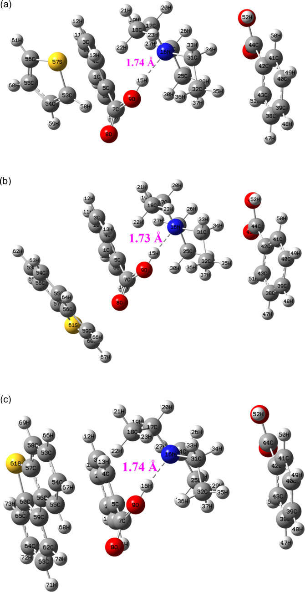
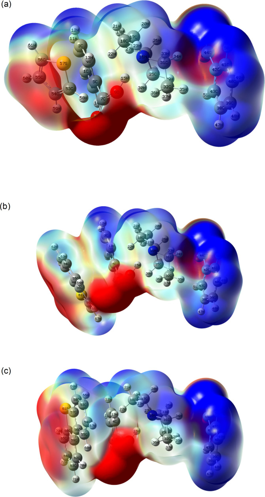
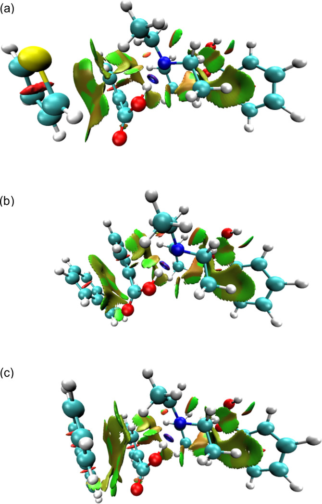

## Formation and Extractive Desulfurization Mechanisms of Aromatic Acid Based Deep Eutectic Solvents: An Experimental and Theoretical Study 芳酸型深共晶溶剂的形成及萃取脱硫机理：实验与理论研究

> Dr. Xiuxiu Zhao, Guoqiang Zhu, Lingying Jiao, Dr. Fengli Yu, Prof. Dr. Congxia Xie  
> Chem. Eur. J. 2018, 24, 11021 – 11032  
> DOI: [10.1002/chem.201801631](https://doi.org/10.1002/chem.201801631)  
> Keywords: deep eutectic solvents, density functional theory, extractive desulfurization, noncovalent interactions, reaction mechanisms

### Abstract
The formation and extractive desulfurization (EDS) mechanisms of aromatic acid based deep eutectic solvents (DESs) were studied experimentally and through quantum chemistry calculations. Hydrogen bonding and van der Waals forces were investigated as the driving forces for the formation of aromatic acid based DESs by means of 1H NMR and FTIR spectroscopy, and DFT calculations. The driving forces of EDS were also studied. The results showed that van der Waals forces and other weak interactions were the main diving forces for EDS, and the structures of the aromatic acid based DESs did not change after EDS. The interaction energy between the aromatic acid based DESs and thiophene (TH), benzothiophene (BT), and dibenzothiophene (DBT) were calculated by DFT to understand the EDS order: TH< BT< DBT. Moreover, the optimal EDS conditions were studied. The amount of BT (500 ppm) was reduced to below 10 ppm under the optimal conditions of using triethylamine/o‐hydroxybenzoic acid ([TEA]/[OHBA]). The desulfurization efficiency of [TEA]/[OHBA] was stable after ten cycles, and the mechanical loss of [TEA]/[OHBA] could be ignored.  
对芳香酸基深共熔溶剂（DESs）的形成和萃取脱硫（EDS）机理进行了实验研究，并通过量子化学计算进行了研究。通过1H NMR和FTIR光谱以及DFT计算，研究了氢键和范德华力作为形成芳酸基DES的驱动力。还研究了EDS的驱动力。结果表明，范德华力和其他弱相互作用是EDS的主要驱动力，EDS后芳酸基DES的结构没有改变。通过DFT计算芳族酸基DES与噻吩（TH），苯并噻吩（BT）和二苯并噻吩（DBT）之间的相互作用能，以了解EDS顺序：TH < BT < DBT。此外，研究了最佳EDS条件。在使用三乙胺/邻羟基苯甲酸（[TEA]/[OHBA]）的最佳条件下，BT（500（ppm）的量减少到10 ppm以下。 [TEA]/[OHBA]的脱硫效率在十个循环后稳定，可以忽略[TEA]/[OHBA]的机械损失。

### Introduction
Sulfur compounds in petroleum produce sulfur oxides (SOx) during combustion. It is known that sulfur oxides cause significant environmental and health problems, such as acid rain, respiratory disease, and cancer.1 Thus, a serious of regulations have been established in many countries for petroleum refineries to reduce the sulfur content of diesel fuels to near‐zero levels (<10 ppm), but these regulations have put forth a critical challenge to the refinery industry.2 At present, hydrodesulfurization (HDS), a traditional commercial technology, is widely used to purify diesel fuel. HDS is a high‐energy‐consumption technology, which has limited capacity to efficiently reduce heterocyclic S‐compounds, such as benzothiophene (BT), dibenzothiophene (DBT), and their derivatives.2 Thus, it is necessary to develop an alternative or supplementary technology with low energy consumption and high efficiency of HDS. Many non‐HDS technologies have been developed, such as extractive desulfurization (EDS),3 oxidative desulfurization (ODS),2 adsorptive desulfurization (ADS),4 and others.5 Among them, EDS is considered as one of the most attractive methods to obtain diesel fuels with ultralow sulfur content because of its moderate and convenient operation conditions.1, 6-8  
石油中的硫化合物在燃烧过程中会产生硫氧化物（SOx）。众所周知，氧化硫会引起严重的环境和健康问题，例如酸雨，呼吸道疾病和癌症。1因此，许多国家/地区已针对石油精炼厂制定了严格的法规，以将柴油中的硫含量降低至接近零水平（<10 ppm），但这些法规对炼油业提出了严峻挑战。2目前，传统的商业技术加氢脱硫（HDS）被广泛用于净化柴油。 HDS是一种高能耗技术，其有效还原杂环S化合物（例如苯并噻吩（BT），二苯并噻吩（DBT）及其衍生物）的能力有限。2因此，有必要开发替代品或补充品低能耗，高效率的HDS技术。已经开发了许多非HDS技术，例如萃取脱硫（EDS），3氧化脱硫（ODS），2吸附脱硫（ADS），4等。5其中，EDS被认为是最有吸引力的方法之一。由于操作条件适中且方便，因此可获得硫含量极低的柴油。1、6-8

Deep eutectic solvents (DESs), a new class of ionic liquid (IL) analogues, have been deemed as new green solvents that exhibit low acute toxicity and can be rapidly degraded in the environment.9 DESs have more advantages than those of ILs, such as diversity, the use of cheap raw materials, and a simple and green synthetic process without purification. Furthermore, DESs are described as “designer solvents” due to their high tunability.10-12 Therefore, many researchers have been engaged in the exploitation of DESs in chemical synthesis, separation, biochemistry, electrochemistry, and other areas.13-15  
深共熔溶剂（DES）是一类新型的离子液体（IL）类似物，被认为是具有低急性毒性并且可以在环境中迅速降解的新型绿色溶剂。9DES比IL更具优势，例如由于种类繁多，使用了廉价的原料，并且无需纯化即可进行简单且绿色的合成过程。此外，由于DES的高度可调性，它们被描述为“设计溶剂”。10-12因此，许多研究人员已在化学合成，分离，生物化学，电化学和其他领域从事DES的开发。13-15

It is worth noting that DESs were also introduced into the extraction desulfurization field by Li et al. in 2013.3 They discovered a class of DESs by using tetrabutylammonium chloride (TBAC) as the hydrogen‐bond acceptor (HBA) and polyethylene glycol (PEG) or propionate (Pr) as the hydrogen bond donor (HBD) mixed in the ratio of HBA/HBD=1:2. Their research showed that the desulfurization efficiency of [TBAC]/[PEG] could reach as high as 82.83 % for one cycle and up to 99.48 % after five cycles under optimal conditions. Li et al. also discovered a class of DESs by using tetrabutylammonium bromide (TBAB) as the HBA and Pr, acetic acid (Ac) or formic acid (Fo) as the HBD. This study provides a new method to synthesize DESs, which are suitable for industrial applications.16 Recently, DES‐EDS has achieved promising results.3, 8, 13, 16, 17 However, there are few studies reporting a combination of experimental results and theoretical calculations for DESs. Understanding the structures of DESs and the interactions between DESs and sulfur compounds is crucial. This will greatly aid researchers to design highly task‐specific DESs with appropriate properties for effective desulfurization.  
值得注意的是，Li等人也将DES引入了萃取脱硫领域。在2013.3中，他们发现氯化四丁基铵（TBAC）作为氢键受体（HBA）和聚乙二醇（PEG）或丙酸酯（Pr）作为氢键供体（HBD）以HBA/HBD = 1：2。他们的研究表明，在最佳条件下，[TBAC]/[PEG]的脱硫效率在一个循环中可以达到82.83％，在五个循环后可以达到99.48％。 Li et al。也通过使用四丁基溴化铵（TBAB）作为HBA和Pr，乙酸（Ac）或甲酸（Fo）作为HBD发现了一类DES。这项研究提供了一种适用于工业应用的合成DES的新方法。16最近，DES‐EDS取得了令人鼓舞的结果。3、8、13、16、17然而，很少有研究报告结合了实验结果和DES的理论计算。了解DES的结构以及DES与硫化合物之间的相互作用至关重要。这将极大地帮助研究人员设计具有特定属性的高度任务特定的DES，以进行有效的脱硫。

To understand the formation and EDS mechanisms of aromatic acid based DESs both experimentally and theoretically, triethylamine/benzoic acid ([TEA]/[BA]) and its analogues were chosen as research subjects. First, [TEA]/[BA] and its analogues were successfully synthesized and characterized by means of FTIR and 1H NMR spectroscopy. Their physicochemical properties were also studied. Then, the formation and extraction desulfurization effects of these DESs were studied and compared through experimental methods. Subsequently, DFT was employed to investigate the formation and EDS mechanisms of [TEA]/[BA] and its analogues.  
为了从实验和理论上了解芳酸基DES的形成和EDS机理，选择了三乙胺/苯甲酸（[TEA]/[BA]）及其类似物作为研究对象。首先，成功合成了[TEA]/[BA]及其类似物，并通过FTIR和1H NMR光谱对其进行了表征。还研究了它们的理化性质。然后，通过实验方法研究和比较了这些DES的形成和萃取脱硫效果。随后，DFT被用于研究[TEA]/[BA]及其类似物的形成和EDS机理。

### Results and Discussion
#### Synthesis
As shown in Scheme 1, HBAs (TEA, tributylamine (TBA), trihexylamine (THA), trioctylamine (TOH), N‐methylmorpholine (NMM), N,N‐dimethylbenzylamine (BDMA)) and HBDs (BA, o‐hydroxybenzoic acid (OHBA), o‐methylbenzoic acid (OMBA), o‐methoxybenzoic acid (OMOBA), o‐fluorobenzoic acid (OFBA), o‐chlorobenzoic acid (OCBA), o‐bromobenzoic acid (OBBA), o‐nitrobenzoic acid (ONBA)) were charged into a 100 mL round‐bottomed flask at a certain molar ratio (mostly 1:2 herein) and strongly stirred at 90 °C for 1 h. Then, the transparent and homogenous viscous liquid DESs were obtained with different colors (Figure S1 in the Supporting Information).  
如方案1所示，HBA（TEA，三丁胺（TBA），三己胺（THA），三辛胺（TOH），N-甲基吗啉（NMM），N，N-二甲基苄胺（BDMA））和HBD（BA，邻羟基苯甲酸） （OHBA），邻甲基苯甲酸（OMBA），邻甲氧基苯甲酸（OMOBA），邻氟苯甲酸（OFBA），邻氯苯甲酸（OCBA），邻溴苯甲酸（OBBA），邻硝基苯甲酸（ONBA ））以一定摩尔比（此处为1：2）装入100 mL圆底烧瓶中，并在90 C下强烈搅拌1 h。然后，获得具有不同颜色的透明且均匀的粘性液体DES（支持信息中的图S1）。

  
Scheme 1. Synthetic route to different aromatic acid based DESs.

#### Characterization
The structures of the aromatic acid based DESs were characterized by means of FTIR and 1H NMR spectroscopy (Figure 1). From the FTIR spectra of BA and [TEA]/[BA], it can be seen that the absorption of −OH is significantly strengthened and widened at $\tilde{v} \approx 3400 cm^{-1}$ of [TEA]/[BA], which indicates the formation of a hydrogen bond between TEA and BA. The band at $\tilde{v} \approx 933 cm^{−1}$ belongs to OH⋅⋅⋅O, which indicates that BA tends to exist in the morphology of dimers.18 The blueshift of C=O of BA from $\tilde{v} \approx 1687 to 1703 cm^{−1}$ is because the morphology of the dimers is destroyed by the hydrogen bond between TEA and BA. The shift of all H atoms of [TEA]/[BA] to lower field intensities, as shown in the 1H NMR spectra, may be because of the formation of hydrogen bonds or other interactions between TEA and BA. Therefore, more work should be carried out to study the formation mechanism of aromatic acid based DESs.  
通过FTIR和1H NMR光谱对芳香酸基DES的结构进行了表征（图1）。从BA和[TEA]/[BA]的FTIR光谱中可以看出，在$\tilde{v} \approx 3400 cm^{-1}$时，[TEA]/[BA]的-OH的吸收显着增强和扩展，表示TEA和BA之间形成氢键。$\tilde{v} \approx 933 cm^{−1}$的谱带属于OH⋅⋅⋅O，这表明BA倾向于以二聚体形态存在[18]。 $\tilde{v} \approx 1687 to 1703 cm^{−1}$的BA的C = O是因为TEA和BA之间的氢键破坏了二聚体的形态。如图1H NMR光谱所示，[TEA]/[BA]的所有H原子向较低场强的移动可能是由于TEA和BA之间形成氢键或其他相互作用。因此，需要做更多的工作来研究芳酸基DES的形成机理。

  
Figure 1. FTIR and 1H NMR spectra of BA and [TEA]/[BA].

#### Physicochemical properties of the aromatic acid based DESs
##### Density

Density is an important physical property of the aromatic acid based DESs because it can affect the separation of oil and DES. The densities of [TEA]/[BA] and its analogues, which have been measured by using a pycnometer at room temperature and atmospheric pressure, are shown in Table 1. These densities are in the range of 0.99–1.47 g cm−3, which are higher than that of oil. The densities of DESs decrease compared with that of [TEA]/[BA] if the chains of the HBAs are extended, whereas the densities increase if the electron‐withdrawing or ‐donating groups are introduced to the adjacent position of the carboxyl group of HBDs, except for [TEA]/[OMBA]. The difference in density between DESs and oil is beneficial for the decantation of oil and DESs.19  
密度是芳族酸基DES的重要物理性质，因为它会影响油和DES的分离。表1列出了使用比重瓶在室温和大气压下测得的[TEA]/[BA]及其类似物的密度，范围为0.99–1.47 g cm-3，高于石油。如果HBA的链延长，则DES的密度比[TEA]/[BA]的密度降低，而如果将吸电子或供电子基团引入HBD羧基的相邻位置，则DES的密度增加，[TEA]/[OMBA]除外。 DES和油之间的密度差异有利于倾析油和DES 19。

Table 1. Physicochemical properties of the aromatic acid based DESs.[a]  
DESs | Density [g cm−3] | Viscosity [cP] | Td [°C] | Oil/DES [%] | DES/oil [%]
:- | :- | :- | :- | :- | :-
[TEA]/[BA] | 1.08 | 251.00 | 82 | 2.98 | 0.31
[TBA]/[BA] | 1.02 | 396.12 | 74 | 3.35 | 0.34
[THA]/[BA] | 0.99 | 171.35 | 74 | 19.87 | 5.52
[TOA]/[BA] | 0.95 | 151.50 | 82 | 100 | 100.00
[BDMA]/[BA] | 1.12 | 876.42 | 100 | 1.20 | 0.28
[TEA]/[OHBA] | 1.15 | 749.07 | 149 | 1.13 | 0.11
[TEA]/[OMOBA] | 1.14 | >2000 | 90 | 1.50 | 0.52
[TEA]/[OMBA] | 1.07 | 467.00 | 70 | 1.81 | 0.63
[TEA]/[OFBA] | 1.17 | 318.87 | 101 | 0.98 | 0.09
[TEA]/[OCBA] | 1.21 | 675.30 | 120 | 1.13 | 0.14
[TEA]/[OBBA] | 1.47 | 1063.00 | 115 | 1.32 | 0.15
[TEA]/[ONBA] | 1.24 | >2000 | 141 | 1.01 | 0.11

[a] Conditions: 25 °C and atmospheric pressure. Oil/DES: the solubility of oil in the DES. DES/oil: the solubility of DES in the oil.

##### Viscosity
The viscosity of aromatic acid based DESs can affect the mass transfer of oil and DES. High viscosity has a negative impact on saving energy. The viscosities of [TEA]/[BA] and its analogues were measured on a Brookfield DVS viscometer at room temperature and atmospheric pressure. As shown in Table 1, the viscosities of these DESs are in the range of 151–2000 cP. The results demonstrate that the HBAs and HBDs have different effects on the viscosities of the aromatic acid based DESs. The viscosities decrease, compared with that of [TEA]/[BA], if the chains of HBAs are extended, except for [TBA]/[BA]. If the adjacent position of the carboxyl group of the HBD has an electron‐withdrawing or ‐donating group, the viscosities of the DESs are higher than that of [TEA]/[BA], as a result of intermolecular hydrogen bonds. High energy consumption could be caused by high viscosity; therefore, the optimal EDS solvents should be of low viscosity. Accordingly, we can synthesize aromatic acid based DESs with low viscosity through introducing specific functional groups to reduce energy consumption in the EDS process.  
芳酸基DES的粘度会影响油和DES的传质。高粘度会对节能产生负面影响。 [TEA]/[BA]及其类似物的粘度在Brookfield DVS粘度计上在室温和大气压下测量。如表1所示，这些DES的粘度范围为151-2000 cP。结果表明，HBA和HBD对基于芳酸的DES的粘度具有不同的影响。如果[HBA]链延长，与[TEA]/[BA]相比，粘度降低，除了[TBA]/[BA]。如果HBD羧基的相邻位置具有吸电子或供电子基团，则由于分子间氢键，DES的粘度高于[TEA]/[BA]的粘度。高粘度可能会导致高能耗；因此，最佳的EDS溶剂应具有低粘度。因此，我们可以通过引入特定的官能团来降低EDS工艺中的能耗，从而合成低粘度的芳酸基DES。

##### Thermal behavior
Thermal stability is an important concern because an unacceptably low decomposition temperature will severely limit the application of DESs. In this study, the thermal stabilities of all DESs were determined through thermogravimetric analysis measurements at a scanning rate of 10 °C min−1. As shown in Table 1, the decomposition temperatures (Td) of [TEA]/[BA] and its analogues are in the range of 70–149 °C. [TEA]/[OFBA] (Td=101 °C), [TEA]/[OCBA] (Td=120 °C), [TEA]/[OBBA] (Td=115 °C), and [TEA]/[ONBA] (Td=141 °C) have better thermal stabilities than that of [TEA]/[BA]. It seems that introducing electron‐withdrawing groups is an effective way to improve the thermal stability. Therefore, the thermal stability can be controlled by introducing electron‐withdrawing groups.  
热稳定性是一个重要的问题，因为不可接受的低分解温度将严重限制DES的应用。在这项研究中，所有DES的热稳定性都是通过热重分析测量法以10°C min-1的扫描速率确定的。如表1所示，[TEA]/[BA]及其类似物的分解温度（Td）在70-149°C之间。 [TEA]/[OFBA]（Td = 101°C），[TEA]/[OCBA]（Td = 120°C），[TEA]/[OBBA]（Td = 115°C）和[TEA]/[ONBA]（Td = 141 C）具有比[TEA]/[BA]更好的热稳定性。引入吸电子基团似乎是提高热稳定性的有效方法。因此，可以通过引入吸电子基团来控制热稳定性。

#### Mutual solubility of the aromatic acid based DESs and model oil
As shown in Table 1, the length of the alkyl chains of HBAs has a great influence on the mutual solubility of the DESs and oil if the HBDs are the same. The mutual solubility of DESs and model oil increased due to the high lipophilicity caused by the long alkyl chain.  
如表1所示，如果HBD相同，则HBA的烷基链的长度对DES和油的互溶性具有很大的影响。 DES和模型油的互溶性由于长烷基链引起的高亲脂性而增加。

DESs with high polarity always have a lower mutual solubility, whereas those with low polarity usually have a higher mutual solubility.1 As shown in Table 1, if the adjacent position to the carboxyl group has an electron‐withdrawing group, the mutual solubility of the DESs and oil is lower than that of [TEA]/[BA] and oil, as result of the higher polarity of these DESs. However, if electron‐donating groups were introduced adjacent to the carboxyl group, the mutual solubility of the DESs and oil was also lower than that of [TEA]/[BA] and oil due to intramolecular hydrogen bonds, which caused an increase in acidity. Therefore, we can obtain DESs with lower solubility through introducing appropriate functional groups adjacent to the carboxyl group.  
具有高极性的DES总是具有较低的互溶性，而具有低极性的DES通常具有较高的互溶性。1如表1所示，如果羧基的相邻位置具有吸电子基团，则DES的互溶性DES和机油比[TEA]/[BA]和机油低，这是因为这些DES的极性较高。但是，如果在羧基附近引入给电子基团，则由于分子内氢键的作用，DES和油的互溶性也低于[TEA]/[BA]和油的互溶性，从而导致酸度增加。因此，我们可以通过在羧基附近引入合适的官能团来获得具有较低溶解度的DES。

#### EDS by aromatic acid based DESs
##### Effects of HBA and HBD on the extraction of BT
The HBAs have a great influence on the mutual solubility of the aromatic acid based DESs and model oil. However, different types of HBAs have little effect on the extraction of BT (Figure 2 a). Therefore, we chose TEA as the HBA because of lower mutual solubility and price.  
HBA对基于芳酸的DES与模型油的互溶性有很大影响。但是，不同类型的HBA对BT的提取几乎没有影响（图2a）。因此，由于较低的互溶性和价格，我们选择TEA作为HBA。

  
Figure 2. a) Effect of HBA on the extraction of BT. b) The effect of HBD with an electron‐withdrawing group on the extraction of BT. c) The effect of HBD with an electron‐donating group on the extraction of BT (conditions: 30 °C, 30 min, the concentration of sulfur compounds is 500 ppm).  
图2. a）HBA对BT提取的影响。 b）带有吸电子基团的HBD对萃取BT的影响。 c）带给电子基团的HBD对BT萃取的影响（条件：30 C，30 min，硫化合物的浓度为500 ppm）。

As shown in Figure 2 b, the desulfurization rate (DR) of BT is not consistent with the acidity of DESs. A stronger electron‐withdrawing group results in higher polarity of the DESs and lower DR of BT. Introducing an electron‐withdrawing group adjacent to the carboxyl group is a contradictory method to achieve higher desulfurization of BT. The relationship between the polarity of DESs, mutual solubility, and the DR of BT was reasonably balanced herein, so excellent DESs were achieved to apply in EDS.  
如图2b所示，BT的脱硫率（DR）与DESs的酸度不一致。较强的吸电子基团导致DES的极性更高，而BT的DR更低。在羧基附近引入吸电子基团是实现BT更高脱硫的自相矛盾的方法。 DES的极性，互溶性和BT的DR之间的关系在这里是合理平衡的，因此获得了优异的DES应用于EDS。

To achieve a higher DR, HBDs in which an electron‐donating group was adjacent to the carboxyl position were also investigated. Our previous work on extraction desulfurization with ILs showed that hydrogen bonding was one of the main driving forces for EDS.20 Thus, introducing a hydroxyl group on the carboxyl position is a key method to obtain excellent DESs. Herein, OHBA was chosen as the HBD and TEA was chosen as the HBA, from which [TEA]/[OHBA] was synthesized. Figure 2 c shows that [TEA]/[OHBA] has a higher DR of BT than that of [TEA]/[BA], but a lower mutual solubility in fuel oil. The reasoning may be as follows: the p–π interaction between the hydroxyl and benzene ring strengthens the π–π interaction between the benzene ring and BT,21, 22 and the existence of the hydroxyl group increases the chances of forming hydrogen bond between the DESs and sulfur compounds. It should be noted that the mutual solubility in fuel oil is low because of the existence of intramolecular hydrogen bonds that can increase the acidity of the DESs. However, the DR of BT is decreased if a methoxy group is adjacent to the carboxyl group due to the increase in viscosity caused by intermolecular hydrogen bonding. The [TEA]/[OMBA] system was designed to research the phenomenon that intermolecular hydrogen bonding has an effect on EDS. As shown in Table 1 and Figure 2 c, the viscosity of [TEA]/[OMBA] is much lower and the DR is much higher than those of [TEA]/[OMOBA].  
为了获得更高的DR，还研究了供电子基团与羧基位置相邻的HBD。我们先前使用ILs进行萃取脱硫的工作表明，氢键是EDS的主要驱动力之一。20因此，在羧基位置引入羟基是获得优异DES的关键方法。在此，选择OHBA作为HBD，选择TEA作为HBA，由此合成[TEA]/[OHBA]。图2c显示[TEA]/[OHBA]比[TEA]/[BA]的BT具有更高的DR，但在燃料油中的互溶性较低。原因可能如下：羟基与苯环之间的p–π相互作用增强了苯环与BT，21，22之间的π–π相互作用，羟基的存在增加了在苯环之间形成氢键的机会。 DES和硫化合物。应当指出的是，由于存在分子内氢键会增加DES的酸度，因此在燃油中的互溶性很低。但是，由于分子间氢键引起的粘度增加，如果甲氧基与羧基相邻，则BT的DR降低。 [TEA]/[OMBA]系统旨在研究分子间氢键对EDS有影响的现象。如表1和图2c所示，与[TEA]/[OMOBA]相比，[TEA]/[OMBA]的粘度低得多，并且DR高得多。

As outlined above, we mainly studied the effect of the structure of DESs on desulfurization performance. This work will help us to better understand the mechanism of extraction desulfurization and better design functional DESs. The desulfurization performance was mainly affected by electronic effects and steric hindrance from the viewpoint of the molecular structure of DESs. The [TEA]/[BA] and [TEA]/[OHBA] systems were chosen to investigate the optimal conditions of EDS.  
如上所述，我们主要研究了DES的结构对脱硫性能的影响。这项工作将帮助我们更好地了解萃取脱硫的机理和更好地设计功能性DES。从DESs的分子结构的角度来看，脱硫性能主要受电子效应和位阻的影响。选择[TEA]/[BA]和[TEA]/[OHBA]系统来研究EDS的最佳条件。

##### Effects of different sulfur compounds on EDS
Various model oils with different sulfur compounds were prepared to fully investigate the extractive selectivity of the DESs. As shown in Table 2, the desulfurization efficiency followed the trend of DBT>BT>TH. Many studies have shown that the density of the electron cloud of sulfur compounds has a significant influence on sulfur removal.3, 23, 24 According to conceptual density theory, the density of electrons increases in the order of TH < bBT < DBT and steric hindrance has a negative influence on the desulfurization performance, so the desulfurization efficiency follows the trend of DBT>BT>TH. Similar extractive selectivities of different sulfur compounds were reported in other papers14, 24 about other ILs and DESs.  
制备了具有不同硫化合物的各种模型油，以充分研究DES的萃取选择性。如表2所示，脱硫效率遵循DBT> BT> TH的趋势。许多研究表明，硫化合物的电子云的密度对脱硫有重要影响。3，23，24根据概念密度理论，电子密度按TH < bBT < DBT和空间位阻的顺序增加对脱硫性能有负面影响，因此脱硫效率遵循DBT> BT> TH的趋势。在其他论文14、24中，关于其他IL和DES，也报道了不同硫化合物的相似萃取选择性。

Table 2. Effect of sulfur compounds on the desulfurization efficiency of DESs.[a]
 
EDS | TH [%] | BT [%] | DBT [%]
:- | :- | :- | :-
[TEA]/[BA] | 58.06 | 70.61 | 78.30
[TEA]/[OHBA] | 59.08 | 76.55 | 81.04

[a] mDES/mOil=1.5:1, 30 °C, 30 min, Csulfur=500 ppm.

##### Effects of different extraction conditions on EDS
The effects of different extraction conditions on EDS were also investigated (Figure S2 in the Supporting Information). Optimal conditions of mDES/mOiL=1.5:1, t=10 min, and T=30 °C were obtained. The results show that the desulfurization efficiency of BT was not clearly influenced by the initial concentration of BT. The amount of BT (500 ppm) was reduced to <10 ppm after a three‐stage extraction under the optimal conditions. The aromatic acid based DESs were saturated by sulfur compounds after six cycles. Therefore, saturated [TEA]/[BA] and [TEA]/[OHBA] should be regenerated for the next round of EDS.  
还研究了不同提取条件对EDS的影响（支持信息中的图S2）。获得了mDES/mOiL = 1.5：1，t = 10 min和T = 30 C的最佳条件。结果表明，BT的脱硫效率不受BT初始浓度的明显影响。在最佳条件下进行三步萃取后，BT（500 ppm）的量减少至<10 ppm。六个循环后，基于芳酸的DES被硫化合物饱和。因此，应该为下一轮EDS再生饱和的[TEA]/[BA]和[TEA]/[OHBA]。

#### Regeneration of the aromatic acid based DESs
Recovery and reuse of DESs is important for industrialization, not only from an economic aspect, but also from an environmental aspect. The [TEA]/[OHBA] system was used to investigate the properties after recycling (Figure 3). It should be noted that the extraction rate for BT of [TEA]/[OHBA] was stable after ten cycles and the loss of DES could be ignored. Furthermore, according to the 1H NMR and FTIR spectra (Figure 3 b and c), the structure of the recycled DES did not change. Based on the original structure being retained after EDS, the recyclability of aromatic acid based DESs is achieved, which provides attractive opportunities for large‐scale industrial application.  
DES的回收和再利用对于工业化而言非常重要，不仅从经济方面，而且从环境方面。 [TEA]/[OHBA]系统用于研究回收后的性能（图3）。应该注意的是，[TEA]/[OHBA]的BT提取速率在十个循环后是稳定的，可以忽略DES的损失。此外，根据1 H 3 NMR和FTIR光谱（图3b和c），回收的DES的结构没有改变。基于EDS之后保留的原始结构，可以实现基于芳酸的DES的可回收性，这为大规模工业应用提供了诱人的机会。

  
Figure 3. Recycling and regeneration of the DES. a) The DR of regenerated [TEA]/[OHBA] (mDES/mOil=1.5:1, 30 °C, 10 min, [BT]=500 ppm). b) The 1H NMR spectrum of fresh and regenerated [TEA]/[OHBA]. c) The FTIR spectrum of fresh and regenerated [TEA]/[OHBA].  
图3. DES的回收和再生。 a）re再生的[TEA]/[OHBA]的DR（mDES/mOil = 1.5：1，30°C，10，min，[BT] = 500 ppm）。 b）新鲜和再生的[TEA]/[OHBA]的1H NMR光谱。 c）新鲜和再生的[TEA]/[OHBA]的FTIR光谱。

#### Theoretical studies on aromatic‐acid based DESsl
##### Analysis of the formation mechanism of aromatic acid based DESs
###### Structure analysis
The gas‐phase configurations of [TEA]/[BA], [TEA]/[OMBA], [TEA]/[OMOBA], [TEA]/[OHBA], [TEA]/[OCBA], [TEA]/[ONBA], [TBA]/[BA], and [BDMA]/[BA] optimized at the B3LYP‐D3/6‐311G** level of computation are shown in Figure 4 and Figure S6 in the Supporting Information. There are no imaginary frequencies for any of the structures that indicate a local minimum.  
[TEA]/[BA]，[TEA]/[OMBA]，[TEA]/[OMOBA]，[TEA]/[OHBA]，[TEA]/[OCBA]，[TEA]/在支持信息中的图4和图S6中显示了在B3LYP-D3/6-311G **计算级别上优化的[ONBA]，[TBA]/[BA]和[BDMA]/[BA]。对于任何表示局部最小值的结构，都没有虚频率。

  
Figure 4. Optimized structures of a) [TEA]/[BA], b) [TEA]/[OHBA], and c) [TEA]/[ONBA].

In [TEA]/[BA], two BA molecules are distributed on either side of TEA (Figure 4 a). Nonbonded interactions exist between one BA molecule and TEA, such as N16⋅⋅⋅H15 (1.75 Å), which can be identified as a strong hydrogen bond because of the much shorter distance than that of the van der Waals radius. In the hydrogen bond of N16⋅⋅⋅H15, the HBD is the OH group from the BA on the left side of the system, whereas the HBA is the N atom from TEA. Nevertheless, there is no hydrogen bond between the BA on the right side of the system and TEA. It should be noted that only distances shorter than the van der Waals radius are portrayed by dashed lines herein and the inner nonbonded interactions in BA or TEA are not shown. Similarly, in [TEA]/[OHBA] (Figure 4 b), [TEA]/[ONBA] (Figure 4 c), [TEA]/[OMBA], [TEA]/[OMOBA], [TEA]/[OCBA], [TBA]/[BA], and [BDMA]/[BA] (Figure S6 a–e, respectively, in the Supporting Information), the two HBD molecules are distribute on both sides of HBA, and the HBD on the left side only forms hydrogen bonds with the HBA molecule. Differently, the lengths of hydrogen bonds in [TEA]/[OMBA] (1.76 Å), [TEA]/[OMOBA] (1.77 Å), and [TEA]/[OHBA] (1.78 Å), which have electron‐donating groups adjacent to the carboxyl position of BA, are slightly longer than that in [TEA]/[BA]; the lengths of hydrogen bonds in [TEA]/[OCBA] (1.74 Å) and [TEA]/[ONBA] (1.70 Å), which have electron‐withdrawing groups adjacent to the carboxyl position of BA, are slightly shorter than that in [TEA]/[BA]. This indicates that the introduction of electron‐withdrawing groups into BA is beneficial for the formation of strong hydrogen bonds between HBA and HBD. Possibly, because of strong hydrogen bonds, the decomposition temperatures of [TEA]/[OFBA], [TEA]/[OCBA], [TEA]/[OBBA], and [TEA]/[ONBA] are higher than that of [TEA]/[BA].  
在[TEA]/[BA]中，两个BA分子分布在TEA的任一侧（图4a）。一个BA分子与TEA之间存在非键相互作用，例如N16·⋅·H15（1.75Å），由于距离比范德华半径短得多，因此可以确定为强氢键。在N16·⋅·H15的氢键中，HBD是系统左侧BA的OH基，而HBA是TEA的N原子。但是，系统右侧的BA和TEA之间没有氢键。应该注意的是，这里仅用虚线描绘了比范德华半径短的距离，并且未示出BA或TEA中的内部非键相互作用。同样，在[TEA]/[OHBA]（图4 b）中，[TEA]/[ONBA]（图4 c），[TEA]/[OMBA]，[TEA]/[OMOBA]，[TEA]/[ OCBA]，[TBA]/[BA]和[BDMA]/[BA]（在支持信息中分别为图S6 a-e），两个HBD分子分布在HBA的两侧，而HBD分布在左侧仅与HBA分子形成氢键。不同的是，[TEA]/[OMBA]（1.76Å），[TEA]/[OMOBA]（1.77Å）和[TEA]/[OHBA]（1.78Å）中具有给电子性的氢键长度与BA的羧基位置相邻的基团比[TEA]/[BA]中的基团稍长； [TEA]/[OCBA]（1.74Å）和[TEA]/[ONBA]（1.70Å）中具有与BA羧基相邻的吸电子基团的氢键长度略短于[TEA]/[BA]。这表明在BA中引入吸电子基团有利于HBA和HBD之间形成牢固的氢键。 [TEA]/[OFBA]，[TEA]/[OCBA]，[TEA]/[OBBA]和[TEA]/[ONBA]的分解温度可能比[ TEA]/[BA]。

From the above results, structural analysis preliminarily proves the existence of hydrogen bonds between TEA and HBD, HBA, and BA, which indicates that interactions between the groups in the eutectic mixture interrupt the main interactions within the parent compound.25 Additionally, hydrogen bonds may contribute to redshifts of the IR spectra. Intramolecular interactions in the aromatic acid based DESs may not only be hydrogen‐bonding interaction, so more work will be carried out to seek the answer.  
根据以上结果，结构分析初步证明了TEA与HBD，HBA和BA之间存在氢键，这表明低共熔混合物中各基团之间的相互作用中断了母体化合物中的主要相互作用。25此外，氢键可能有助于红外光谱的红移。芳酸基DES中的分子内相互作用可能不仅是氢键相互作用，因此将进行更多的工作以寻求答案。

###### Electrostatic potential (ESP) analysis
It is well known that ESP analysis, as a reflection of electron density, is significant for noncovalent interaction systems. For noncovalent interaction systems, van der Waals interactions, hydrogen‐bonding interactions, and other interactions may coexist. All, or only a few, kinds of noncovalent interaction may play important roles in weak interactions for different noncovalent systems.  
众所周知，ESP分析作为电子密度的反映，对于非共价相互作用系统非常重要。对于非共价相互作用系统，范德华相互作用，氢键相互作用和其他相互作用可能共存。所有或仅几种非共价相互作用可能在不同非共价系统的弱相互作用中发挥重要作用。

Herein, we carried out ESP analysis to qualitatively understand the configurations involved in the formation of aromatic acid based DESs. The ESPs of BA and TEA are mapped onto their electron densities in Figure S9 a,b in the Supporting Information. Results show that the electronegative area is around the oxygen atoms, whereas the electropositive area is around the hydrogen atoms for BA (Figure S9 a in the Supporting Information). For TEA, a large electronegative area is around the nitrogen atom, whereas other positive areas are close to hydrogen atoms (Figure S9 b in the Supporting Information). It can be predicted that the electropositive area of BA has an attraction for the electronegative area of TEA, whereas the electronegative area of BA will be close to the electropositive area of TEA during formation of the monomer model of [TEA]/[BA]. The stable configuration of [TEA]/[BA] obtained confirms this prediction (Figure 5 a). Similarly, the electropositive areas of OMBA, OMOBA, OHBA, OCBA, and ONBA (Figure S9 c–g, respectively, in the Supporting Information) are attracted to the electronegative areas of TEA, whereas the electronegative areas of OMBA, OMOBA, OHBA, OCBA, and ONBA will be close to the electropositive area of TEA during the formation of the monomer models of [TEA]/[OHBA] (Figure 5 b), [TEA]/[ONBA] (Figure 5 c), [TEA]/[OMBA], [TEA]/[OMOBA], and [TEA]/[OCBA] (Figure S7 a–c, respectively, in the Supporting Information); the electropositive areas of BA are attracted to the electronegative areas of TBA and BDMA (Figure S9 h–i in the Supporting Information), whereas the electronegative area of BA will be close to the electropositive areas of TBA and BDMA during the formation of the monomer models of [TBA]/[BA], and [BDMA]/[BA] (Figure S7 d and e, respectively, in the Supporting Information). The stable configuration of the aromatic acid based DESs is in accordance with ESP analysis and in accordance with monomer models of HBDs and HBAs.  
在这里，我们进行了ESP分析，以定性地了解基于芳酸的DES的形成所涉及的构型。在支持信息中的图S9 a，b中，BA和TEA的ESP被映射到它们的电子密度。结果表明，BA的负电性区域位于氧原子周围，而正电性区域位于氢原子周围（支持信息中的图S9 a）。对于TEA，氮原子周围有一个较大的负电区域，而其他正区域则靠近氢原子（支持信息中的图S9 b）。可以预见，在[TEA]/[BA]单体模型的形成过程中，BA的正电区对TEA的负电区具有吸引力，而BA的负电区将接近TEA的正电区。获得的[TEA]/[BA]的稳定构型证实了这一预测（图5a）。同样，OMBA，OMOBA，OHBA，OCBA和ONBA的电正性区域（在支持信息中分别为图S9 c-g）被TEA的电负性区域吸引，而OMBA，OMOBA，OHBA，在[TEA]/[OHBA]（图5 b），[TEA]/[ONBA]（图5 c），[TEA]单体模型形成期间，OCBA和ONBA将接近TEA的正电区域。/[OMBA]，[TEA]/[OMOBA]和[TEA]/[OCBA]（在支持信息中分别为图S7 a-c）； BA的正电性区域被TBA和BDMA的负电性区域吸引（支持信息中的图S9 h–i），而在单体形成过程中，BA的负电性区域将接近TBA和BDMA的电正性区域[TBA]/[BA]和[BDMA]/[BA]的模型（支持信息中分别为图S7 d和e）。芳族酸基DES的稳定构型符合ESP分析以及HBD和HBA的单体模型。

  
Figure 5. ESPs mapped on electron total density with an isovalue 0.001 au. The colors range from −12.6 kcal mol−1 (−0.0200 au) shown in red, 0 kcal mol−1 in white, and +12.6 kcal mol−1 (+0.0200 au) in blue for a) [TEA]/[BA], b) [TEA]/[OHBA], and c) [TEA]/[ONBA].  
图5. ESP映射到等密度为0.001 withau的电子总密度上。对于a）[TEA]/[BA]，颜色的范围从红色显示为-12.6 kcal mol-1（-0.0200 au），白色为0 kcal mol-1和蓝色+12.6 kcal mol-1（+0.0200 au）。 ]，b）[TEA]/[OHBA]和c）[TEA]/[ONBA]。

###### Reduced density gradient (RDG) analysis
RDG analysis is a useful tool to map and analyze noncovalent interactions in real space based on the electron density and its derivatives. This analysis reveals the underlying chemistry that compliments the covalent structure and provides a rich representation of van der Waals interactions, hydrogen bonds, and steric repulsion in small molecules, molecular complexes, and solids. The RDG and electron density are generated herein by using the Multiwfn program. More specific details about this approach are reported in the literature.26 The electron density (ρ) and RDG (s) for [TEA]/[BA], [TEA]/[OMBA], [TEA]/[OMOBA], [TEA]/[OHBA], [TEA]/[OCBA], [TEA]/[ONBA], [TBA]/[BA], and [BDMA]/[BA] are plotted in Figure S10 in the Supporting Information. There are spikes in the low‐density (ρ<0.07) and low‐gradient regions (s<0.6), which are the signatures of noncovalent interactions for aromatic acid based DESs.  
RDG分析是一种有用的工具，可基于电子密度及其导数来映射和分析现实空间中的非共价相互作用。该分析揭示了构成共价结构的基础化学，并提供了小分子，分子配合物和固体中范德华相互作用，氢键和空间排斥的丰富表示。 RDG和电子密度在这里通过使用Multiwfn程序生成。文献中报道了有关该方法的更多具体细节。26[TEA]/[BA]，[TEA]/[OMBA]，[TEA]/[OMOBA]，[ TEA]/[OHBA]，[TEA]/[OCBA]，[TEA]/[ONBA]，[TBA]/[BA]和[BDMA]/[BA]绘制在支持信息中的图10S10中。低密度（ρ<0.07）和低梯度区域（s <0.6）出现尖峰，这是基于芳酸的DES的非共价相互作用的特征。

To distinguish different types of interactions (i.e., hydrogen bonding and steric crowding) in the same region of density/reduced gradient space, another method is applied to visualize the interaction types by plotting the RDG versus the electron density multiplied by the sign of the second Hessian eigenvalue.26 Figure 6 and Figure S8 in the Supporting Information provide plots of the gradient isosurfaces (s=0.5 au) for [TEA]/[BA], [TEA]/[OHBA], [TEA]/[OMBA], [TEA]/[ONBA], [TEA]/[OMOBA], [TEA]/[OCBA], [TBA]/[BA], and [BDMA]/[BA]. The surfaces are colored on a blue–green–red scale according to values of sin (λ2)ρ, ranging from −0.04 to 0.02 au. Blue represents strong attractive interactions (e.g., hydrogen bonding, strong electrostatic interactions), whereas red represents strong nonbonded overlap and the transition region represents typical van der Waals interactions, including dipole–dipole, dispersion, and hydrophobic interactions. From Figure 6 a, it can be seen that the region in the blue circle is clearly hydrogen bonding (N16⋅⋅⋅H15). In addition, two large flakes between BA and TEA, the color of which is in the transition region, may reveal the existence of van der Waals interactions in the monomer structure of [TEA]/[BA]. Similar results can be found in [TEA]/[OHBA], [TEA]/[ONBA], [TEA]/[OMBA], [TEA]/[OMOBA], [TEA]/[OCBA], and [TBA]/[BA]. It should be noted that the inner hydrogen bonds in OMOBA, OHBA, OCBA, ONBA are shown. Particularly, from Figure S8 e in the Supporting Information, the region between BA on the left side and BDMA can be classified as π–π interactions. Typical hydrogen bonds labeled by blue circles are in accordance with the original structural analysis. RDG analysis reveals that both hydrogen bonds and van der Waals (and π–π interactions for [BDMA]/[BA]) coexist in the monomer structure of the DESs, which are responsible for the decrease in freezing points and formation of DESs.  
为了在密度/减小的梯度空间的同一区域中区分不同类型的相互作用（即氢键和空间拥挤），另一种方法通过绘制RDG对电子密度乘以第二个正负号来可视化相互作用类型Hessian特征值。26支持信息中的图6和图8提供了[TEA]/[BA]，[TEA]/[OHBA]，[TEA]/[OMBA]的梯度等值面（s = 0.5 au）的图， [TEA]/[ONBA]，[TEA]/[OMOBA]，[TEA]/[OCBA]，[TBA]/[BA]和[BDMA]/[BA]。根据sin（λ2）ρ的值（从-0.04到0.02 au），表面以蓝绿色红色标度着色。蓝色代表很强的吸引力相互作用（例如氢键，强静电相互作用），而红色代表很强的未键合重叠，过渡区代表典型的范德华相互作用，包括偶极-偶极，分散和疏水相互作用。从图6a可以看出，蓝色圆圈中的区域显然是氢键（N16⋅⋅⋅H15）。另外，BA和TEA之间的两个大薄片（其颜色在过渡区域中）可能揭示[TEA]/[BA]单体结构中存在范德华相互作用。在[TEA]/[OHBA]，[TEA]/[ONBA]，[TEA]/[OMBA]，[TEA]/[OMOBA]，[TEA]/[OCBA]和[TBA]中可以找到类似的结果/[BA]。应当指出，显示了OMOBA，OHBA，OCBA，ONBA中的内部氢键。特别是，根据支持信息中的图S8，可以将左侧BA与BDMA之间的区域归类为π-π相互作用。用蓝色圆圈标记的典型氢键与原始结构分析一致。 RDG分析表明，氢键和范德华力（以及[BDMA]/[BA]的π-π相互作用）共存于DES的单体结构中，这是导致DES凝固点降低和形成的原因。

  
Figure 6. Gradient isosurfaces (s=0.5 au) for a) [TEA]/[BA], b) [TEA]/[OHBA], and c) [TEA]/[ONBA]. The surfaces are displayed on a blue–green–red scale with respect to the values of sin (λ2)ρ, ranging from −0.04 to 0.02 au. The strongest attractions related to hydrogen bonds are displayed in blue; weak interactions, such as van der Waals, are displayed in light green; and steric repulsions are displayed in red. Carbon atoms are displayed in light blue, nitrogen atoms are in dark blue, oxygen atoms are in red, chlorine atoms are in green, and hydrogen atoms are in white.  
图6. a）[TEA]/[BA]，b）[TEA]/[OHBA]和c）[TEA]/[ONBA]的梯度等值面（s = 0.5 au）。相对于sin（λ2）ρ值（从-0.04到0.02 au），表面以蓝绿色红色刻度显示。与氢键相关的最强吸引力以蓝色显示；弱互动（例如范德华）以浅绿色显示；和空间排斥显示为红色。碳原子显示为浅蓝色，氮原子显示为深蓝色，氧原子显示为红色，氯原子显示为绿色，氢原子显示为白色。

##### Analysis of the EDS mechanism of aromatic acid based DESs
###### Structure analysis
The gas‐phase configurations of [TEA]/[BA]⋅⋅⋅TH, [TEA]/[BA]⋅⋅⋅BT, [TEA]/[BA]⋅⋅⋅DBT, [TEA]/[OMBA]⋅⋅⋅BT, [TEA]/[OMOBA]⋅⋅⋅BT, [TEA]/[OHBA]⋅⋅⋅BT, [TEA]/[OCBA]⋅⋅⋅BT, [TEA]/[ONBA]⋅⋅⋅BT, [TBA]/[BA]⋅⋅⋅BT, and [BDMA]/[BA]⋅⋅⋅BT optimized at the B3LYP‐D3/6‐311G** level of computation are shown in Figure 7 and Figure S8 in the Supporting Information. There are no imaginary frequencies for any of the structures that indicate a local minimum.  
[TEA]/[BA]⋅⋅⋅TH，[TEA]/[BA]⋅⋅⋅BT，[TEA]/[BA]⋅⋅⋅DBT，[TEA]/[OMBA]⋅ ⋅⋅BT，[TEA]/[OMOBA]⋅⋅⋅BT，[TEA]/[OHBA]⋅⋅⋅BT，[TEA]/[OCBA]⋅⋅⋅BT，[TEA]/[ONBA]⋅⋅⋅⋅在计算级别B3LYP-D3/6-311G **下优化的BT，[TBA]/[BA]···BT和[BDMA]/[BA]···BT分别如图7和图8所示。支持信息。对于任何表示局部最小值的结构，都没有虚频率。

  
Figure 7. Optimized structures of a) [TEA]/[BA]⋅⋅⋅TH, b) [TEA]/[BA]⋅⋅⋅BT, and c) [TEA]/[BA]⋅⋅⋅DBT.

The results from the optimized geometries indicate that TH, BT, and DBT tend to be close to the BA on the left side of [TEA]/[BA]. By comparing the geometric structures of [TEA]/[BA] (Figure 4 a), [TEA]/[BA]⋅⋅⋅TH (Figure 7 a), [TEA]/[BA]⋅⋅⋅BT (Figure 7 b), and [TEA]/[BA]⋅⋅⋅DBT (Figure 7 c), introducing TH, BT, and DBT into the [TEA]/[BA] system shortens the hydrogen bonds slightly. That is, the introduction of TH, BT, and DBT has a smaller effect on the structures of [TEA]/[BA]. Similar results can be found in [TEA]/[OMBA]⋅⋅⋅BT, [TEA]/[OMOBA]⋅⋅⋅BT, [TEA]/[OHBA]⋅⋅⋅BT, [TEA]/[OCBA]⋅⋅⋅BT, [TEA]/[ONBA]⋅⋅⋅BT, [TBA]/[BA]⋅⋅⋅BT, and [BDMA]/[BA]⋅⋅⋅BT (Figure S8 in the Supporting Information). This indicates that the structures of these aromatic acid based DESs are stable if aromatic sulfur compounds are introduced.  
优化的几何结构的结果表明，TH，BT和DBT倾向于接近[TEA]/[BA]左侧的BA。通过比较[TEA]/[BA]（图4 a），[TEA]/[BA]··⋅TH（图7 a），[TEA]/[BA]··⋅BT（图7）的几何结构b）和[TEA]/[BA]·⋅·DBT（图7c），将TH，BT和DBT引入[TEA]/[BA]系统中会略微缩短氢键。也就是说，TH，BT和DBT的引入对[TEA]/[BA]的结构影响较小。在[TEA]/[OMBA]⋅⋅⋅BT，[TEA]/[OMOBA]⋅⋅⋅BT，[TEA]/[OHBA]⋅⋅⋅BT，[TEA]/[OCBA]⋅中可以找到类似的结果⋅⋅BT，[TEA]/[ONBA]⋅⋅⋅BT，[TBA]/[BA]⋅⋅⋅BT和[BDMA]/[BA]⋅⋅⋅BT（支持信息中的图S8）。这表明如果引入芳族硫化合物，这些基于芳酸的DES的结构是稳定的。

###### ESP analysis
ESP analysis was carried out to qualitatively understand the configurations of [TEA]/[BA]⋅⋅⋅TH, [TEA]/[BA]⋅⋅⋅BT, [TEA]/[BA]⋅⋅⋅DBT, [TEA]/[OMBA]⋅⋅⋅BT, [TEA]/[OMOBA]⋅⋅⋅BT, [TEA]/[OHBA]⋅⋅⋅BT, [TEA]/[OCBA]⋅⋅⋅BT, [TEA]/[ONBA]⋅⋅⋅BT, [TBA]/[BA]⋅⋅⋅BT, and [BDMA]/[BA]⋅⋅⋅BT. The ESPs are mapped onto their electron densities in Figure 8 and Figure S9 in the Supporting Information. The ESPs of TH, BT, and DBT are mapped onto their electron densities in Figure S10 in the Supporting Information. Figure S10 a in the Supporting Information displays the ESP of the TH molecule. The electropositive area is around TH, whereas the negative area stays at the inner cycle of this molecule. The distributions of ESPs for BT and DBT (Figure S10 b,c in the Supporting Information) molecules are similar to that of TH. According to Figure 5 a, in the main view, the electropositive region remains at the benzene ring of BA, whereas the electronegative region is around −COOH of BA. The TH, BT, and DBT molecules interact with the benzene ring of BA through its electronegative part (π–π interaction). Similar results can be found in [TEA]/[OMBA]⋅⋅⋅BT, [TEA]/[OMOBA]⋅⋅⋅BT, [TEA]/[OHBA]⋅⋅⋅BT, [TEA]/[OCBA]⋅⋅⋅BT, [TEA]/[ONBA]⋅⋅⋅BT, [TBA]/[BA]⋅⋅⋅BT, and [BDMA]/[BA]⋅⋅⋅BT (Figure S9 in the Supporting Information). These interactions efficiently stabilize the systems.  
进行ESP分析以定性地了解[TEA]/[BA]⋅⋅⋅TH，[TEA]/[BA]⋅⋅⋅BT，[TEA]/[BA]⋅⋅⋅DBT，[TEA]的构型/[OMBA]⋅⋅⋅BT，[TEA]/[OMOBA]⋅⋅⋅BT，[TEA]/[OHBA]⋅⋅⋅BT，[TEA]/[OCBA]⋅⋅⋅BT，[TEA]/[ ONBA]⋅⋅⋅BT，[TBA]/[BA]⋅⋅⋅BT和[BDMA]/[BA]⋅⋅⋅BT。在支持信息中，图8和图9中将ESP映射到其电子密度上。 TH，BT和DBT的ESP在支持信息中的图S10中映射到它们的电子密度。支持信息中的图S10a显示TH分子的ESP。电正区域在TH左右，而负区域停留在该分子的内部循环。 BT和DBT的ESP分布（支持信息中的图S10 b，c）与TH相似。根据图5a，在主视图中，正电区保留在BA的苯环上，而负电区在BA的-COOH附近。 TH，BT和DBT分子通过其负电性部分与BA的苯环相互作用（π-π相互作用）。在[TEA]/[OMBA]⋅⋅⋅BT，[TEA]/[OMOBA]⋅⋅⋅BT，[TEA]/[OHBA]⋅⋅⋅BT，[TEA]/[OCBA]⋅中可以找到类似的结果⋅⋅BT，[TEA]/[ONBA]⋅⋅⋅BT，[TBA]/[BA]⋅⋅⋅BT和[BDMA]/[BA]⋅⋅⋅BT（支持信息中的图S9）。这些交互有效地稳定了系统。

  
Figure 8. ESPs mapped on electron total density with an isovalue of 0.001 au. The colors range from −12.6 kcal mol−1 (−0.0200 au) in red, 0 kcal mol−1 in white, and +12.6 kcal mol−1 (+0.0200 au) in blue for a) [TEA]/[BA]⋅⋅⋅TH, b) [TEA]/[BA]⋅⋅⋅BT, and c) [TEA]/[BA]⋅⋅⋅DBT.  
图8. ESP映射到电子总密度，等值值为0.001 au。对于a）[TEA]/[BA]，颜色的范围为红色的-12.6 kcal mol-1（-0.0200 au），白色的0 kcal mol-1（+0.0200 au）。 ⋅⋅⋅TH，b）[TEA]/[BA]⋅⋅⋅BT，和c）[TEA]/[BA]⋅⋅⋅DBT。

###### RDG analysis
RDG analysis is studied to better explore the EDS mechanism of aromatic acid based DESs. The electron density (ρ) and RDG (s) for [TEA]/[BA]⋅⋅⋅TH, [TEA]/[BA]⋅⋅⋅BT, [TEA]/[BA]⋅⋅⋅DBT [TEA]/[OMBA]⋅⋅⋅BT, [TEA]/[OMOBA]⋅⋅⋅BT, [TEA]/[OHBA]⋅⋅⋅BT, [TEA]/[OCBA]⋅⋅⋅BT, [TEA]/[ONBA]⋅⋅⋅BT, [TBA]/[BA]⋅⋅⋅BT, and [BDMA]/[BA]⋅⋅⋅BT are plotted in Figure S11 in the Supporting Information. There are spikes in the low‐density (ρ<0.07) and low‐gradient region (s<0.6), which are the signatures of noncovalent interactions between aromatic acid based DESs and aromatic sulfur compounds (TH, BT, and DBT). For [TEA]/[BA]⋅⋅⋅TH, Figure 9 a shows that most of the interactions between [TEA]/[BA] and the TH molecule are van der Waals surfaces. For [TEA]/[BA]⋅⋅⋅BT and [TEA]/[BA]⋅⋅⋅DBT, in Figure 9 b and c, respectively, we observe larger van der Waals surfaces between [TEA]/[BA] and the aromatic sulfur compounds than that shown in Figure 9 a. The main interactions in these systems are large van der Waals surfaces, which follow the order of TH< BT< DBT between [TEA]/[BA] and the aromatic sulfur compounds.  
研究RDG分析可更好地探索基于芳酸的DES的EDS机理。 [TEA]/[BA]⋅⋅⋅TH，[TEA]/[BA]⋅⋅⋅BT，[TEA]/[BA]⋅⋅⋅DBT[TEA]的电子密度（ρ）和RDG（s）/[OMBA]⋅⋅⋅BT，[TEA]/[OMOBA]⋅⋅⋅BT，[TEA]/[OHBA]⋅⋅⋅BT，[TEA]/[OCBA]⋅⋅⋅BT，[TEA]/[ ONBA]⋅⋅⋅BT，[TBA]/[BA]⋅⋅⋅BT和[BDMA]/[BA]⋅⋅⋅BT绘制在支持信息中的图S11中。低密度（ρ<0.07）和低梯度区域（s <0.6）出现峰值，这是基于芳酸的DES与芳族硫化合物（TH，BT和DBT）之间非共价相互作用的特征。对于[TEA]/[BA]···TH，[图9] a显示[TEA]/[BA]与TH分子之间的大部分相互作用是范德华表面。对于[TEA]/[BA]⋅⋅⋅BT和[TEA]/[BA]⋅⋅⋅DBT，分别在图9 b和c中，我们观察到[TEA]/[BA]和芳族硫化合物比图9 a所示。这些系统中的主要相互作用是大范德华表面，其在[TEA]/[BA]与芳族硫化合物之间遵循TH < BT < DBT的顺序。

  
Figure 9. Gradient isosurfaces (s=0.5 au) for a) [TEA]/[BA]⋅⋅⋅TH, b) [TEA]/[BA]⋅⋅⋅BT, and c) [TEA]/[BA]⋅⋅⋅DBT. The surfaces are displayed on a blue–green–red scale with respect to the values of sin (λ2)ρ, ranging from −0.04 to 0.02 au. The strongest attractions related to hydrogen bonds are displayed in blue; weak interactions such as van der Waals are displayed in light green color, and steric repulsions are displayed in red. Carbon atoms are displayed in light blue, nitrogen atoms are in dark blue, oxygen atoms are in red, chlorine atoms are in green, and hydrogen atoms are in white.  
图9. a）[TEA]/[BA]⋅⋅⋅TH，b）[TEA]/[BA]⋅⋅BT和c）[TEA]/[BA]的梯度等值面（s = 0.5 au） ⋅⋅⋅DBT。相对于sin（λ2）ρ值（从-0.04到0.02 au），表面以蓝绿色红色刻度显示。与氢键相关的最强吸引力以蓝色显示；弱相互作用（例如范德华力）以浅绿色显示，空间斥力以红色显示。碳原子显示为浅蓝色，氮原子显示为深蓝色，氧原子显示为红色，氯原子显示为绿色，氢原子显示为白色。

##### Analysis of energetic interactions between aromatic acid based DESs and aromatic sulfur compounds
To quantitatively study interactions between aromatic acid based DESs and the aromatic sulfur compounds, the interaction energy between them was calculated at the B3LYP‐D3/6‐311+G** level of computation. The basis set superposition error (BSSE) is also introduced into the interaction energy. We observed that the interaction energies between the aromatic acid based DESs and sulfur compounds obtained for these systems follows the order TH< BT< DBT (Table 3). In terms of calculations, the DR of [TEA]/[BA] follows the order TH< BT< DBT, which is similar to that of the experimental results and RDG analysis.  
为了定量研究基于芳酸的DES与芳族硫化合物之间的相互作用，以B3LYP-D3/6-311 + G **的计算水平计算了它们之间的相互作用能。基集叠加误差（BSSE）也被引入到相互作用能中。我们观察到，基于芳香酸的DES与这些系统获得的硫化合物之间的相互作用能遵循TH < BT < DBT的顺序（表3）。在计算方面，[TEA]/[BA]的DR遵循TH < BT < DBT的顺序，这与实验结果和RDG分析的顺序相似。

Table 3. Interaction energy [kcal mol−1] between [TEA]/[BA] and the aromatic sulfur compounds.  
EDS | Interaction energy [kcal mol−1]
:- | :-
[TEA]/[BA]⋅⋅⋅TH | −6.47
[TEA]/[BA]⋅⋅⋅BT | −6.74
[TEA]/[BA]⋅⋅⋅DBT | −10.60

### Conclusion
A group of novel DESs with aromatic acids as the HBD and TEA as the HBA were synthesized and investigated as extraction agents in the extraction desulfurization process. Aromatic acid based DESs, with low price and simple synthetic procedures, show tremendous application potential. Their physical properties, chemical properties, and mutual solubility can be controlled by introducing different functional groups due to the strong designability of aromatic acid based DESs. The concentration of sulfur compounds could be reduced to <10 ppm in the extraction desulfurization process by using [TEA]/[OHBA] and [TEA]/[BA] after three cycles under the optimal conditions of mDES/mOil=1.5:1, t=10 min, T=25 °C, and Csulfur=500 ppm. It is worth noting that the rate of desulfurization for BT was stable after ten cycles and the mechanical loss of DESs could be ignored.  
合成了一组以芳香酸为HBD，以TEA为HBA的新型DES，并在萃取脱硫过程中作为萃取剂进行了研究。基于芳酸的DES价格低廉且合成步骤简单，具有巨大的应用潜力。由于芳族酸基DES的强大设计能力，可以通过引入不同的官能团来控制它们的物理性质，化学性质和互溶性。在mDES/mOil = 1.5：1的最佳条件下，经过三个循环后，通过使用[TEA]/[OHBA]和[TEA]/[BA]在萃取脱硫过程中，硫化合物的浓度可以降至<10 ppm， t ＝ 10 5分钟，T ＝ 25℃，C ＝ 500ppm。值得注意的是，BT的脱硫速率在十个循环后是稳定的，并且DES的机械损失可以忽略不计。

Hydrogen bonds and van der Waals interactions were investigated as the main driving forces for the formation of aromatic acid based DESs through experimental, ESP, and RDG analyses. The nature of the interactions between the aromatic acid based DESs and sulfur compounds were studied through experimental and theoretical analyses. The van der Waals and other noncovalent interactions between the aromatic acid based DESs and sulfur compounds were investigated as the main driving forces for EDS. The interaction energy between the aromatic acid based DESs and sulfur compounds follows the order TH< BT< DBT, and the interaction energy follows a similar trend to that of the experimental DR.  
通过实验，ESP和RDG分析，研究了氢键和范德华相互作用是形成芳酸基DES的主要驱动力。通过实验和理论分析研究了芳酸基DES与硫化合物之间相互作用的性质。研究了基于芳香酸的DES与硫化合物之间的范德华力和其他非共价相互作用，作为EDS的主要驱动力。芳酸基DES与硫化合物之间的相互作用能遵循TH < BT < DBT的顺序，并且相互作用能遵循与实验DR相似的趋势。

### Experimental Section
#### General
All materials were commercially available and used as received. IR spectra were recorded on a Nicolet Magna IR 560 spectrophotometer (KBr pellets). 1H NMR spectra were performed on an ARX‐400 instrument with tetramethylsilane (TMS) as an internal standard. To determine the thermal stabilities of the described compounds, a TG‐DTG Q2000 differential scanning calorimeter (heating rate: 10 °C min−1) was used.  
所有材料均可商购获得，并按原样使用。红外光谱在Nicolet Magna IR 560分光光度计（KBr沉淀）上记录。 1H NMR光谱是在ARX-400仪器上以四甲基硅烷（TMS）作为内标进行的。为了确定所描述化合物的热稳定性，使用了TG-DTG Q2000差示扫描量热仪（升温速率：10 C min-1）。

#### Theoretical study
Herein, the Gaussian 09 suite of programs27 was primarily employed to optimize configurations, calculate vibrational frequencies, and perform ESP analyses. The Multiwfn program28 and Winvmd program29 were employed to perform RDG analyses. Optimization of the structures and frequency analysis were carried out by using the B3LYP‐D3 functional with the 6‐311G** basis set, and single‐point energies were calculated at the B3LYP‐D3/6‐311+G** level. All configurations were tested to be local minima by frequency calculations and had no imaginary frequencies, which ensured the presence of a minimum.  
在此，高斯09程序套件27主要用于优化配置，计算振动频率以及执行ESP分析。使用Multiwfn程序28和Winvmd程序29进行RDG分析。结构的优化和频率分析是使用具有3-311G **基集的B3LYP-D3功能进行的，并且在B3LYP-D3/6-311 + G **的水平上计算了单点能量。通过频率计算将所有配置测试为局部最小值，并且没有虚数频率，从而确保存在最小值。

#### Preparation of DESs
BA (12.21 g, 0.1 mol) and TEA (5.05 g, 0.05 mol) were added to a 100 mL round‐bottomed flask at 90 °C and strongly mechanically stirred for 60 min. A white transparent liquid was formed first and then a yellow transparent liquid was obtained. The [TEA]/[BA] system was transferred into a 50 mL wide‐mouthed bottle once the DES had cooled to room temperature.13, 30  
在90°C下将BA（12.21μg，0.1μmol）和TEA（5.05μg，0.05μmol）添加到100μmL圆底烧瓶中，并强烈机械搅拌60μmin。首先形成白色透明液体，然后获得黄色透明液体。 DES冷却至室温后，将[TEA]/[BA]系统转移到50 µmL的广口瓶中。13，30

OHBA (o‐hydroxybenzoic acid) (13.81 g, 0.1 mol) and TEA (5.05 g, 0.05 mol) were added to a 100 mL round‐bottomed flask at 90 °C and strongly mechanically stirred for 60 min. A white transparent liquid formed first and then a slightly pink transparent liquid was obtained. The [TEA]/[OHBA] system was transferred to a 50 mL wide‐mouthed bottle once the DES had cooled to room temperature.  
将OHBA（邻羟基苯甲酸）（13.81μg，0.1μmol）和TEA（5.05μg，0.05μmol）添加到90°C的100μmL圆底烧瓶中，并强烈机械搅拌60μmin。首先形成白色透明液体，然后获得浅粉红色透明液体。 DES冷却至室温后，将[TEA]/[OHBA]系统转移至50 µmL的广口瓶中。

#### Mutual solubility of DESs and model oil
The mutual solubility of DES and model oil was investigated through a conventional gravimetric method. n‐Octane (2 g) and DES (2 g) were added to a 50 mL round‐bottomed flask and vigorously stirred at 30 °C for 0.5 h. After standing for 0.5 h, the upper oil was sucked out with a microinjector. The solubility of the fuel in DES could be calculated through the mass difference of the DES saturated with n‐octane and the DES before extraction. After a certain amount of n‐octane was saturated by the DES, the remaining DES was dried under vacuum at 50 °C. The mass difference of the DES was used to estimate the solubility of DES in fuel.  
通过常规的重量分析法研究了DES与模型油的互溶性。将正辛烷（2微克）和DES（2微克）加到50微升圆底烧瓶中，并在30°C剧烈搅拌0.5微小时。静置0.5 h后，用微型注射器吸出上层油。燃料在DES中的溶解度可以通过萃取前用正辛烷饱和的DES与DES的质量差来计算。一定量的正辛烷被DES饱和后，剩余的DES在50°C的真空下干燥。 DES的质量差用于估算DES在燃料中的溶解度。

#### Desulfurization analysis
BT, which was chosen as a typical sulfur‐containing component, was dissolved in n‐octane to prepare the model oil with an initial sulfur content of 500 ppm. The extraction desulfurization process was conducted in a 50 mL round‐bottomed flask. The model oil and DESs were added to the reactor at a mass ratio of DES/oil varying from 0.5:1 to 3:1. The extraction process lasted for 1 h in total at 30 °C and then was left to stand for 0.5 h. A sample was taken from the upper oil phase and the sulfur content of the sample was analyzed by using a microcoulometric detector.  
将被选为典型的含硫组分的BT溶解在正辛烷中，以制备初始硫含量为500 ppm的模型油。萃取脱硫过程在50ul的圆底烧瓶中进行。将模型油和DES以0.51至3：1的DES/油的质量比加入反应器中。提取过程在30°C下总共进行了1 h，然后静置0.5 h。从上层油相中提取样品，并使用微库仑检测器分析样品中的硫含量。

The DR was calculated by using Equation 1:$DR = \frac{C_0 - C_t}{C_0} \times 100 \% $

in which C0 is the initial concentration of BT and Ct is the concentration of BT after extraction.

The sulfur partition coefficient (KN) was calculated by using Equation 2:$K_N = \frac{m_c^{Des}}{m_c^{Oil}}$

in which $m_c^{Des}$ is the mass concentration of BT in the DES phase and $m_c^{Oil}$ is the mass concentration of BT in the oil phase after extraction.

### Recycling and regeneration of DESs
The DESs were regenerated with the method of diluting with water followed by re‐extraction. A 1:1 mixture of water and ethanol (v/v) was added to the raffinate to increase the polarity of DESs. Then, an equal volume of hexane or methyl tert‐butyl ether was added and the sulfur compounds were re‐extracted from the raffinate into the hexane phase. This process was repeated four times and the sulfur compounds in the raffinate were completely removed by re‐extraction. The DES phase was then separated and evaporated to remove the mixture of water and ethanol. The regenerated DES was used for the next EDS cycle.  
用水稀释后再萃取的方法再生DES。将水和乙醇的1：1混合物（v/v）添加到萃余液中，以增加DES的极性。然后，加入等体积的己烷或甲基叔丁基醚，然后从提余液中将硫化合物重新萃取到己烷相中。重复此过程四次，并通过再次萃取将萃余液中的硫化合物完全去除。然后分离出DES相并蒸发以除去水和乙醇的混合物。再生的DES用于下一个EDS循环。

### Characterization data
[TEA]/[BA]: Yellow, transparent, uniform, oily liquid; IR (KBr): urn:x-wiley:09476539:media:chem201801631:chem201801631-math-0008 =3056, 2986, 2945, 2745, 2675, 2611, 2490, 1705, 1600, 1558, 1450, 1384, 1248, 1172, 1070, 789, 716 cm−1; 1H NMR (500 MHz, DCCl3): δ=1.32 (t, 9 H), 3.18 (d, 6 H), 7.41 (m, 4 H), 7.48(m, 2 H), 8.09 (m, 4 H), 9.15 ppm (s, 2 H).

[TBA]/[BA]: Yellow, uniform, oily liquid; IR (KBr): urn:x-wiley:09476539:media:chem201801631:chem201801631-math-0009 =3055, 2964, 2875, 1704, 1556, 1450, 1380, 1250, 715 cm−1; 1H NMR (500 MHz, DCCl3): δ=0.93 (t, 9 H), 1.36 (m, 6 H), 1.69 (m, 6 H), 3.07 (t, 6 H), 7.40 (t, 4 H), 7.47 (t, 4 H), 8.08 (d, 2 H), 9.98 ppm (s, 2 H).

[THA]/[BA]: Yellow, uniform, oily liquid; IR (KBr): urn:x-wiley:09476539:media:chem201801631:chem201801631-math-0010 =2933, 2489, 1712, 1599, 1454, 1554, 1453, 1092, 1033, 841, 761, 696, 645 cm−1; 1H NMR (500 MHz, DCCl3): δ=0.83 (t, 9 H), 1.19–1.38 (m, 18 H), 3.06 (m, 6 H), 7.39 (t, 4 H), 7.46 (m, 2 H), 8.08 (m, 2 H), 9.43 ppm (s, 2 H).

[TOA]/[BA]: Yellow, uniform, oily liquid; IR (KBr): urn:x-wiley:09476539:media:chem201801631:chem201801631-math-0011 =2926, 2473, 1710, 1599, 1554, 1467, 1380, 1313, 1247, 1171, 1118, 1068, 1024, 714 cm−1; 1H NMR (500 MHz, DCCl3): δ=0.85 (t, 9 H),1.16–1.37 (m, 30 H), 1.70 (m, 6 H), 3.86 (m, 6 H), 7.40 (t, 4 H), 7.47 (t, 2 H), 8.09 (m, 4 H), 11.91 ppm (s, 2 H).

[BDMA]/[BA]: Yellow, uniform, oily liquid; IR (KBr): urn:x-wiley:09476539:media:chem201801631:chem201801631-math-0012 =3058, 3032, 2605, 2484, 1704, 1599, 1710, 1599, 1450, 1386, 1309, 838, 685 cm−1; 1H NMR (500 MHz, DCCl3): δ=2.69 (t, 6 H),7.38‐ 7.40 (m, 3 H), 7.43–7.47 (m, 6 H), 7.51–7.53 (m, 2 H), 8.11 (d, 4 H), 12.17 ppm (s, 2 H).

[NMM]/[BA]: Brown, uniform, oily liquid; IR (KBr): urn:x-wiley:09476539:media:chem201801631:chem201801631-math-0013 =3430, 3055, 2935, 2868, 2689, 2615, 1577 1489, 1451, 1353, 1258, 1068, 1171, 1023, 717 cm−1; 1H NMR (500 MHz, DCCl3): δ=2.61 (t, 3 H), 2.70 (s, 4 H), 3.90 (t, 4 H), 7.44 (t, 4 H), 7.54 (t, 4 H), 8.09 (d, 4 H), 12.20 ppm (s, 2 H).

[TEA]/[OMBA]: Yellow, transparent, uniform, oily liquid; IR (KBr): urn:x-wiley:09476539:media:chem201801631:chem201801631-math-0014 =2984, 2607, 2480, 1938, 1704, 1603, 1554, 1455, 1383, 1249, 1162, 1084, 1039, 826, 743, 652 cm−1; 1H NMR (500 MHz, DCCl3): δ=1.31 (t, 9 H), 2.56(s, 6 H), 3.14 (q, 6 H), 7.17 (m, 4 H), 7.26 (d, 2 H), 7.81 (d, 2 H), 10.94 ppm (s, 2 H).

[TEA]/[OMOBA]: Bright‐yellow, transparent, uniform, oily liquid; IR (KBr): urn:x-wiley:09476539:media:chem201801631:chem201801631-math-0015 =2981, 2838, 2673, 2490, 1706, 1601, 1557, 1490, 1465, 1388, 1246, 1169, 1021, 838, 759, 647 cm−1; 1H NMR (500 MHz, DCCl3): δ=1.25 (t, 9 H), 3.07 (q, 6 H), 3.96 (s, 6 H), 6.91 (m, 6 H), 7.33 (d, 2 H), 7.78 (d, 2 H), 10.97 ppm (s, 2 H).

[TEA]/[OHBA]: Pink–yellow, transparent, uniform, oily liquid; IR (KBr): urn:x-wiley:09476539:media:chem201801631:chem201801631-math-0016 =2987, 2676, 2492, 2353, 1605, 1592, 1485, 1383, 1221, 850, 762, 704, 657 cm−1; 1H NMR (500 MHz, DCCl3): δ=1.35 (t, 9 H), 3.20 (q, 6 H), 6.86 (t, 2 H), 6.94 (d, 2 H), 7.39 (t, 2 H), 7.92 (dd, 2 H), 9.29 ppm (s, 2 H).

[TEA]/[OFBA]: Brown, uniform, oily liquid; IR (KBr): urn:x-wiley:09476539:media:chem201801631:chem201801631-math-0017 =2987, 2492, 1714, 1612, 1454, 1384, 1381, 1313, 1227, 1118, 1068, 1024, 787, 689, 521 cm−1; 1H NMR (500 MHz, DCCl3): δ=1.34 (t, 9 H), 3.21 (q, 6 H), 7.06 (t, 2 H), 7.14 (t, 2 H), 7.39 (m, 2 H), 7.90 (t, 2 H), 12.08 ppm (s, 2 H).

[TEA]/[OCBA]: Dark‐green, transparent, uniform, oily liquid; IR (KBr): urn:x-wiley:09476539:media:chem201801631:chem201801631-math-0018 =2977, 2692, 2501, 1936, 1627, 1589, 1485, 1463, 1386, 1340, 1249, 1155, 1031, 862, 757, 667 cm−1; 1H NMR (500 MHz, DCCl3): δ=1.33 (t, 9 H), 3.18(q, 6 H), 7.19–7.26 (m, 4 H), 7.33 (d, 2 H), 7.66 ppm (d, 2 H).

[TEA]/[OBBA]: Brown, uniform, oily liquid; IR (KBr): urn:x-wiley:09476539:media:chem201801631:chem201801631-math-0019 =2985, 2490, 1714, 1589, 1470, 1387, 1257, 1141, 1027, 833, 796, 751, 680, 641, 554 cm−1; 1H NMR (500 MHz, DCCl3): δ=1.36 (t, 9 H), 3.21 (q, 6 H), 7.18 (m, 2 H), 7.27 (d, 2 H), 7.55 (d, 2 H), 7.65 (dd, 2 H).

[TEA]/[ONBA]: Dark‐yellow, transparent, uniform, oily liquid; IR (KBr): urn:x-wiley:09476539:media:chem201801631:chem201801631-math-0020 =2949, 2682, 2945, 1716, 1604, 1532, 1476, 1353, 1281, 1163, 1137, 1074, 793, 738, 697, 649 cm−1; 1H NMR (500 MHz, DCCl3): δ=1.36 (t, 9 H), 3.20 (q, 6 H), 7.45(t, 2 H), 7.57 (3, 2 H), 7.68 (t, 2 H), 11.94 ppm (s, 2 H).