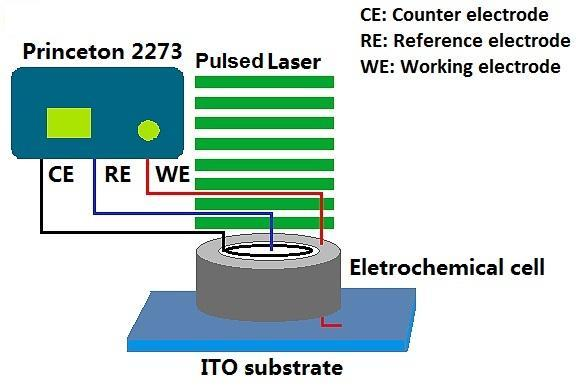
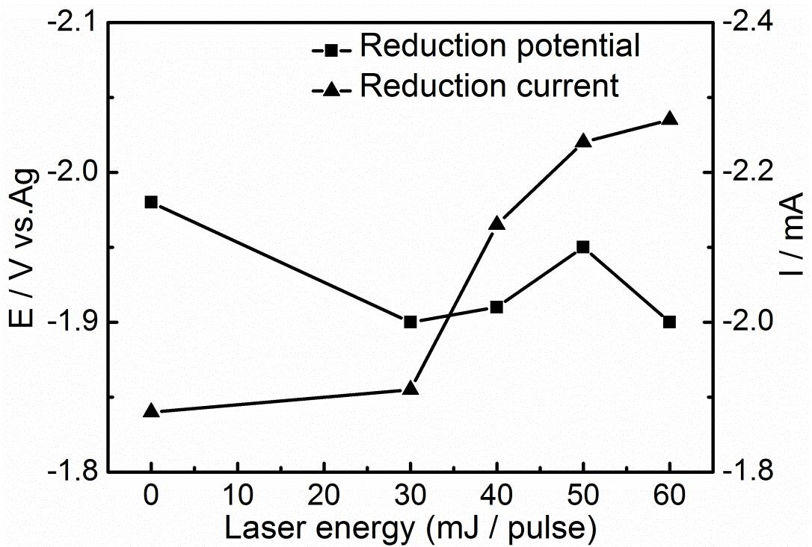
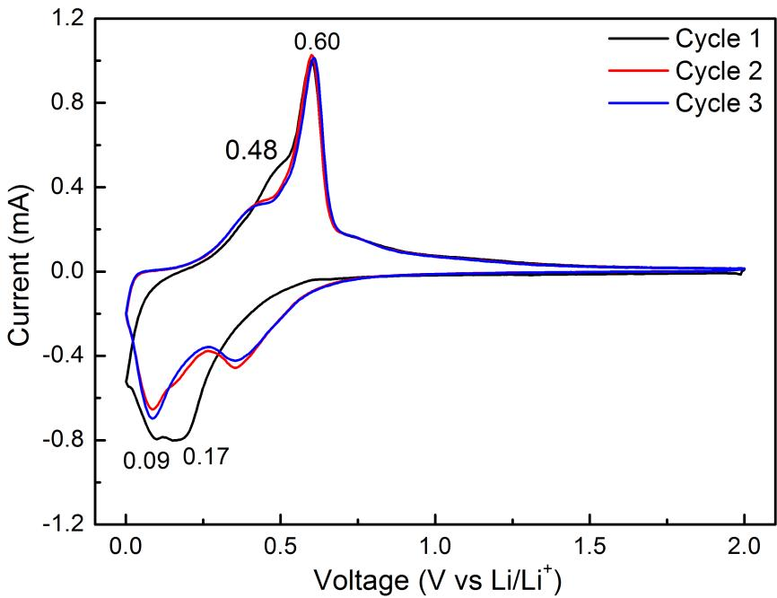
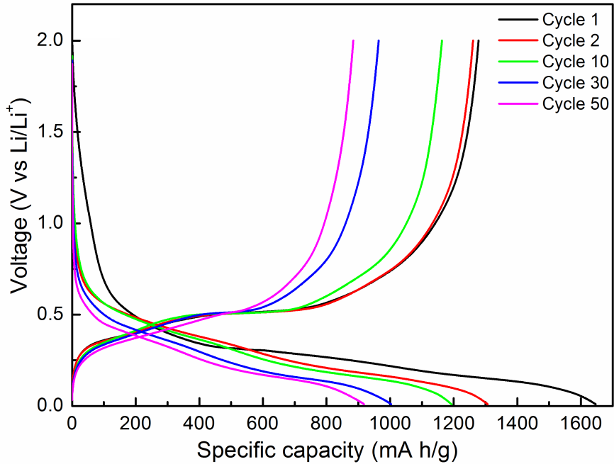
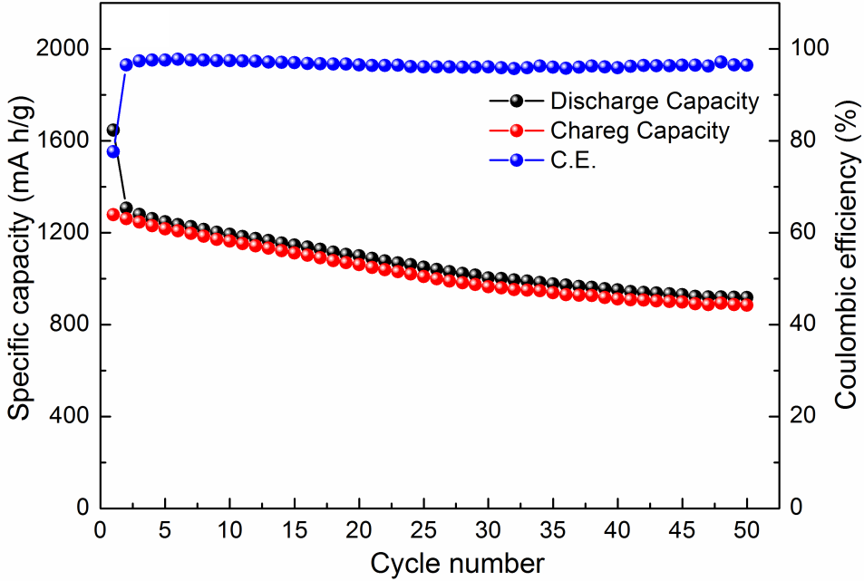
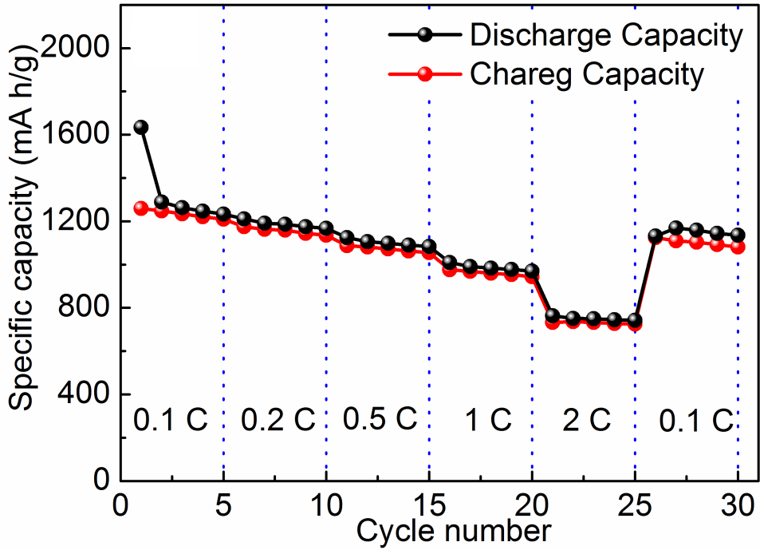
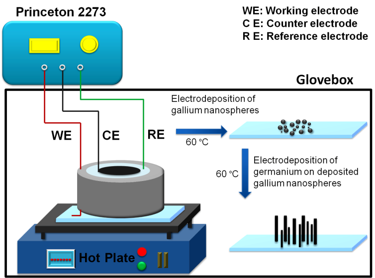
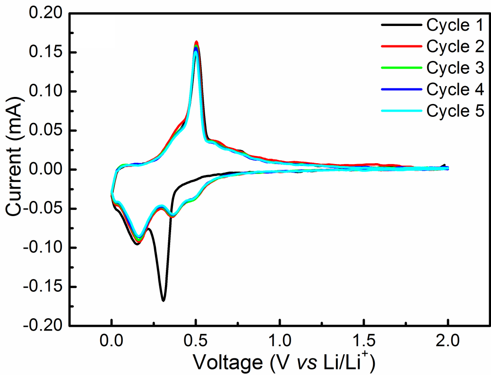
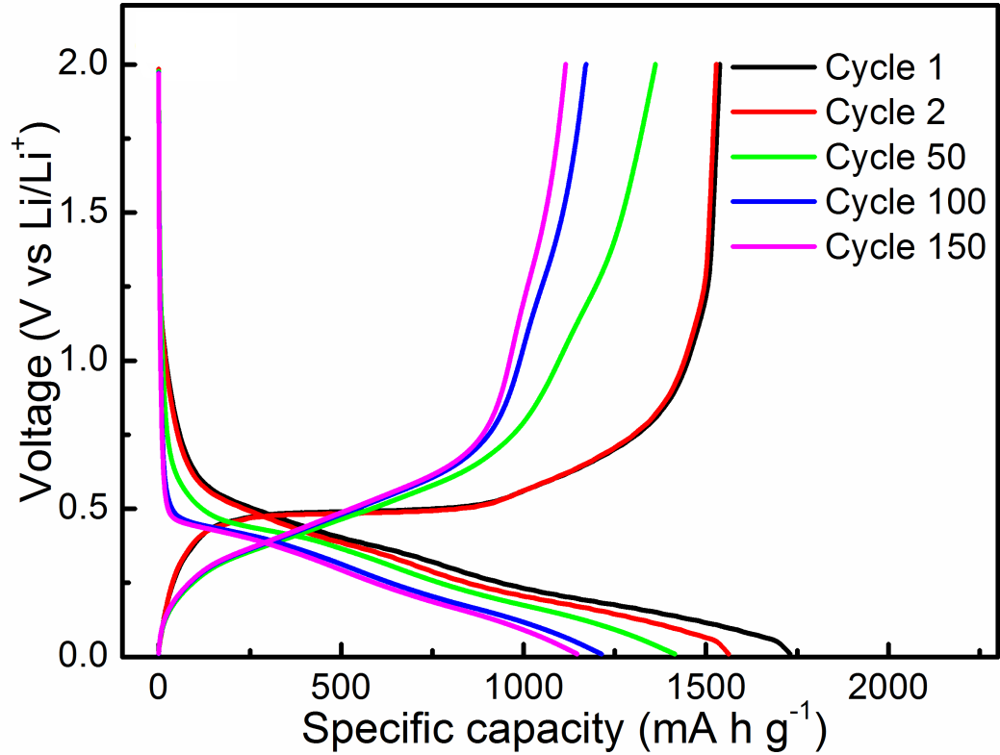
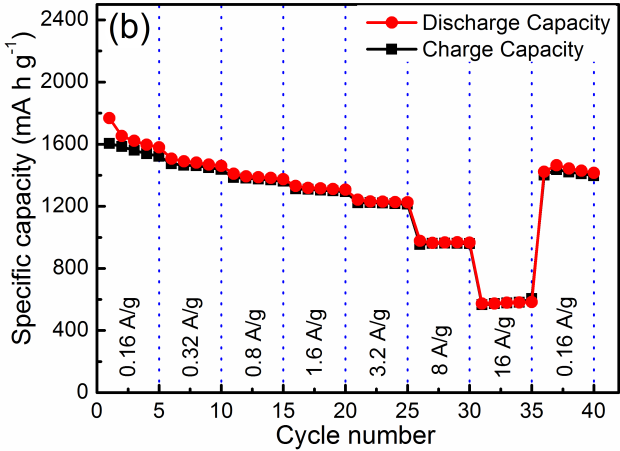

## 题目：离子液体电沉积Ga、Si纳米颗粒与Ge纳米结构及其在锂离子电池中的应用

>作者：于兆亮
>
>关键词：离子液体；电沉积；纳米结构；锂离子电池

### 引言

> 传统石墨电极材料只有372mA/g的低可逆比容量。  
> Ga、Si、Ge等材料代替石墨开发高容量的锂合金电池，  
> 但有充放电过程中大的体积变化的缺陷。  
> 本文设计了两套饰演装置，制备了Ga、Si纳米颗粒及Ga纳米结构，研究了纳米材料的生长机理及锂电池性能。  
> 设备：室温激光辅助离子液体电沉积纳米材料设备  
> 制备了不同形貌的Ge纳米结构

### 第一章 绪论

**1.1 引言**

用纳米颗粒、纳米线、纳米管和三维有序大孔结构缓冲体积变化

**1.2 锂离子电池基本概念**

锂离子电池发展：负极材料 锂 -> 碳材料 $LiC_6$ -> 磷酸盐作为大电流动力锂电池正极材料

工作原理：

**1.3 锂离子电池Ge负极材料的研究进展**

三类负极材料：嵌入型-、合金化型、转化型

**1.6 本文研究内容**

研究激光辐照对离子液体电化学性能的影响。在电沉积过程中使用激光辐照,研究沉积物表面形貌的变化,并探讨了激光的作用机理。

利用脉冲激光辅助离子液体电沉积技术制备了不同形貌的Ge纳米结构。研究了Ge沉积物形貌随着激光能量增加的变化。

利用低温两步离子液体电沉积法在ITO和Cu基片上分别制备出了Ga掺杂的Ge纳米线阵列。

### 第二章 实验材料和测试方法

**实验方法**

*激光辅助离子液体电沉积法：三电极体系*

*两步法离子液体电沉积法*

### 第三章 脉冲激光辅助离子液体电沉积Ga和Si

**结论**

- 激光辐照可以环节离子液体中$[EMIM]^+$阳离子的分解。  
- 激光辐照影响了Ga和Si在电极表面的反应过程，使CV曲线中的还原峰电位正移，还原峰电流增大，沉积速率增加。  
- 激光辐照对Ga和Si沉淀物的形貌有明显影响。  
- 激光辐照的热效应。

### 第四章 脉冲辅助离子液体电沉积Ge纳米结构及其锂电池性能研究

**引言**

Ge的理论比容量低于Si，但Ge高导电率、较小带隙、优良锂离子扩散系数、
Ge纳米线可承受较大体积变化。

传统二维材料：分叉纳米线 -> 新方法：三维分叉

**实验方法**

**实验过程**

- 电极表面的反应过程

以峰电流跟峰电位的数值为纵坐标,激光能量为横坐标,观察峰值随激光能量的变化,结果如图所示。从图中发现,峰值电流整体呈增大趋势,峰值电压整体呈现正移趋势,但是峰值的变化跟激光能量并没有严格的线性关系。

- 激光能量对Ge沉积物表面的影响

当能量增加到 60 mJ/脉冲,从纳米线的主干部分生长出了小的分枝,并且纳米线的长度进一步增加,长度可达 6-7 μm,纳米线的直径并没有明显的变大。

- 沉积物的结构及成分分析

脉冲激光辅助离子液体电沉积制备的 Ge 纳米结构为多晶状态,无需高温及后续退火。

**纳米线负极材料的电化学性能研究**

- Cu箔上电沉积Ge纳米线

- 纳米线负极的循环伏安曲线

第二次与第三次循环曲线重合较好,说明经历第一次循环中SEI膜形成之后,随后的循环中Ge纳米线材料有较好的循环稳定性。

- 纳米线的充放电性能

- Ge纳米线的循环性能

- Ge纳米线的倍率性能

- Ge纳米线50次充放电电循环后的形貌

**脉冲激光辅助离子液体电沉积枝状 Ge 纳米结构**

**Ge纳米结构的生长机理研究**

激光辐照引起的局部温度升高导致Ge形成大晶粒。

### 第五章Ga掺杂的Ge纳米线制备及其锂电池性能研究

**引言**

离子液体中电沉积出的 Ga 呈均匀分散的纳米球,加热后 Ga 将保持在液体状态,适用于电化学 L-L-S沉积 Ge 纳米线。

**两步离子液体电沉积纳米线的实验方法**

先将组装成的电解槽及电极置于加热板上加热 10 min 至 60 °C,然后电沉积 Ga 1 min 得到 Ga 的液态纳米球。随后,在 Ga 纳米球上于 60 °C电沉积 Ge 5 min,得到 Ge-Ga 纳米线。

**Ge-Ga纳米线的制备**

**Ga 球及 Ge-Ga 纳米线的表面形貌**

**Ge-Ga 纳米线的结构及成分分析**

**Ge-Ga 纳米线的生长过程**

当沉积时间为 30 s 时,部分大的 Ga 纳米球已经成长为纳米线形状,小的纳米球仍保持原来的形状。对于沉积时间60 s 的样品,纳米线的长度进一步增加,并且在小的纳米球上也生长出尖状突出。经过 90 s 的沉积,几乎所有的纳米球都成长为纳米线形状。

- 由以上结果可以得出 3 个重要的发现:

   - Ge 会优先沉积在大的 Ga 纳米球上,当大球上的纳米线不再明显生长时,Ge 再沉积在小的 Ga 纳米球上。  
   - 纳米线的长度和直径与 Ga 纳米球的大小直接相关,纳米球越大生长的纳米线也更长、直径更大。  
   - 纳米线不会随着电沉积的进行持续增长,说明纳米线的生长会消耗液态 Ga 纳米球。大的纳米球消耗完后,沉积物进入小的纳米球,所有 Ga 纳米球都消耗完后,Ge沉积物进入纳米线间的缝隙内。
    
**Ge-Ga 纳米线负极材料的电化学性能研究**

- Ge-Ga 纳米线的循环伏安曲线

- Ge-Ga 纳米线的充放电性能

- Ge-Ga 纳米线的循环及倍率性能

**Ge-Ga 纳米线循环后的形貌**

### 第六章 结论