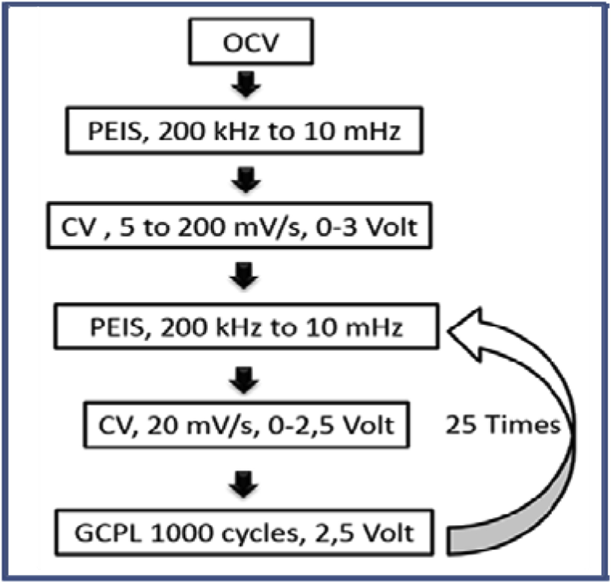
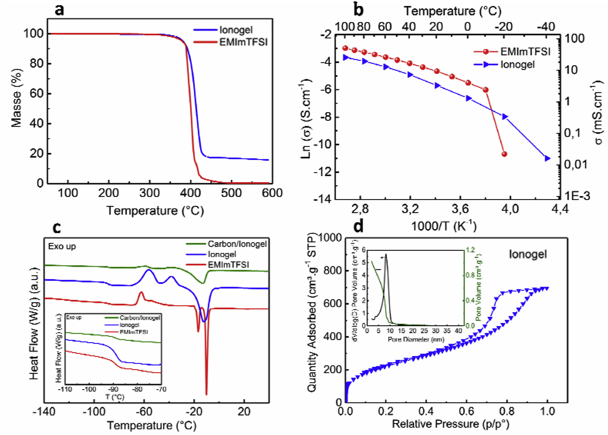
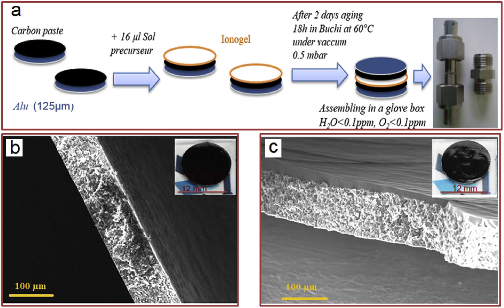
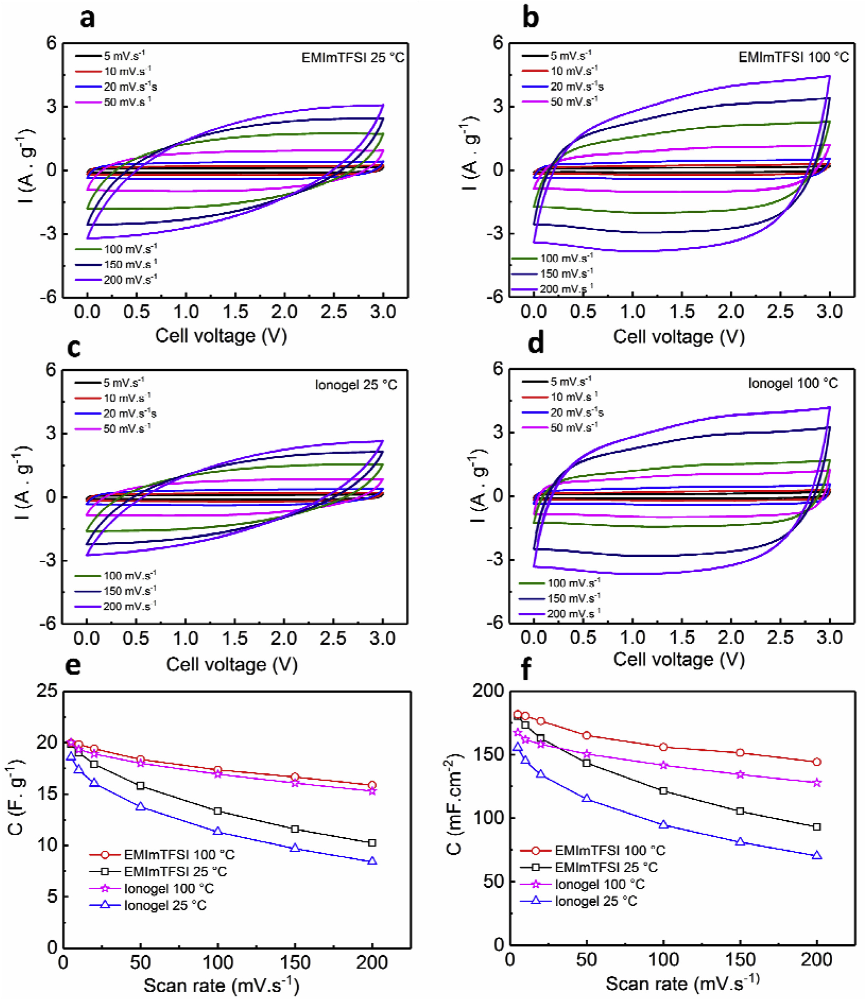
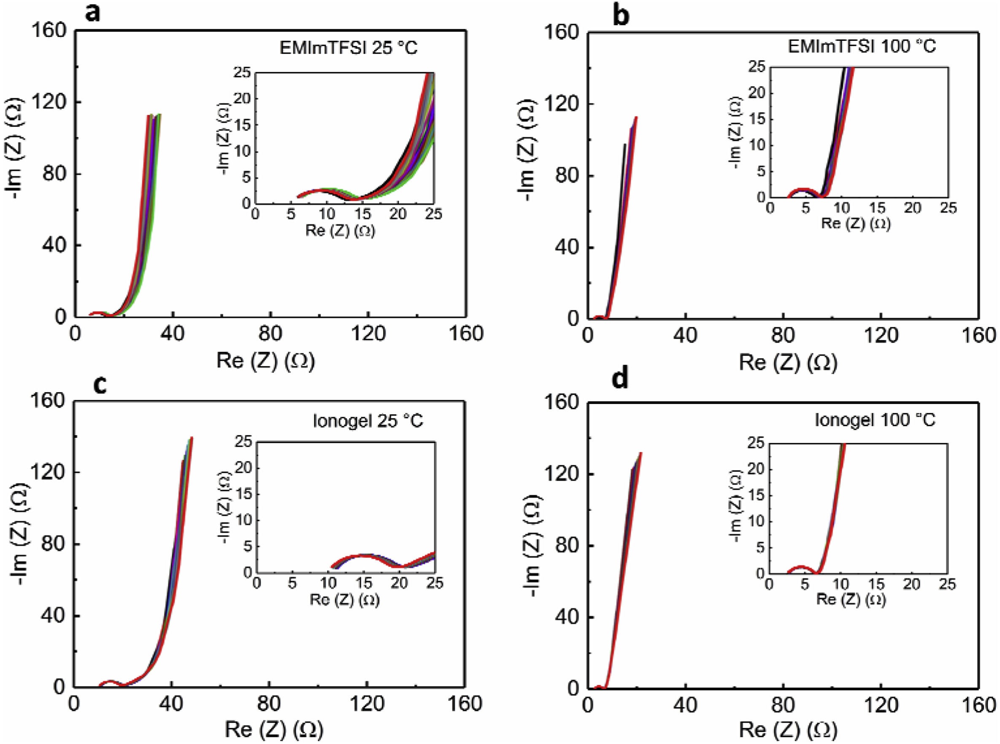
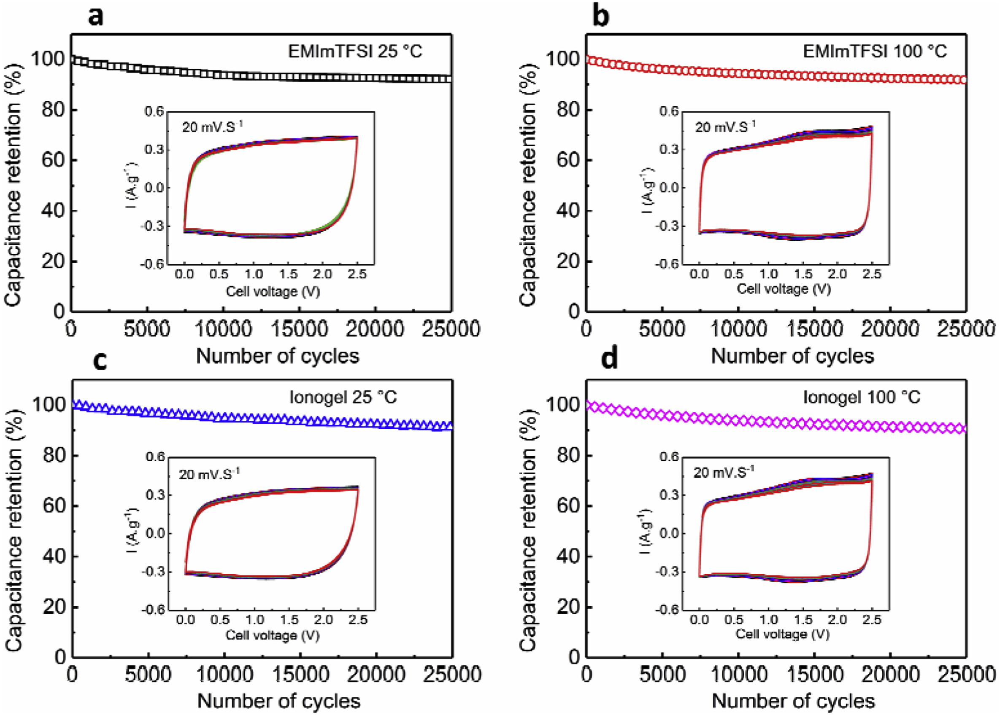

## High temperature solid-state supercapacitor designed with ionogel electrolyte 采用离子凝胶电解质设计的高温固态超级电容器

> Bouchra Asbani, Camille Douard, Thierry Brousse, Jean Le Bideau  
> Energy Storage Materials, Volume 21, September 2019, Pages 439-445
> DOI: [10.1016/j.ensm.2019.06.004](https://doi.org/10.1016/j.ensm.2019.06.004)  
> Keywords: Solid-state supercapacitor, Ionogel, Electrolyte, High temperature, Electrochemical double layer capacitor, Energy storage

### Highlights
> Solid-like EDLCs.
> Safer and flexible devices.
> High temperature.
> Wide potential window.
> Long term galvanostatic charge−discharge cycling.

### Abstract
To date, the design of high temperature electrochemical double layer capacitors (EDLCs) remains a challenge more specifically related to the electrolyte. The electrochemical performance of EDLC can be tuned by the temperature, and a better performance can be achieved at higher temperature if all the components are well suited to this purpose. Subsequently, an all solid-state EDLC operated at high temperature using porous carbon electrodes and a solid-like electrolyte was fabricated. Such an approach opens the route towards safer and flexible devices. An ionogel was used as the solid electrolyte and concomitantly as separator in this all-solid EDLC. The synthetized ionogel exhibits a high ionic conductivity over a wide temperature range, from 4 mS cm−1 at 20 °C up to 26 mS cm−1 cm at 100 °C. The all solid state EDLC thus prepared was able to withstand operating temperature as high as 100 °C, under a 2.5 V cell voltage. Long term galvanostatic charge−discharge cycling over 25 000 cycles were achieved at 100 °C, thus demonstrating very good capacitance retention. The ionogel-based EDLCs therefore appear to be suitable for high temperature environments.  
迄今为止，高温电化学双层电容器（EDLC）的设计仍然是与电解质更具体相关的挑战。 EDLC的电化学性能可以通过温度调节，如果所有组分都非常适合此目的，则可以在更高的温度下获得更好的性能。随后，使用多孔碳电极和固体电解质制备了在高温下操作的全固态EDLC。这种方法为通往更安全，更灵活的设备开辟了道路。在这种全固态EDLC中，离子凝胶被用作固体电解质，并同时被用作隔板。合成的离子凝胶在20°C的4 mS cm-1到100°C的26 mS cm-1cm的宽温度范围内均显示出高离子电导率。如此制备的全固态EDLC在2.5 V的电池电压下能够承受高达100 C的工作温度。在100 C的温度下，在25 cycles000个周期内实现了长期恒电流充放电循环，因此证明了非常好的电容保持率。因此，基于离子凝胶的EDLC似乎适用于高温环境。

### 1. Introduction
Electrochemical double-layer capacitors (EDLCs) also called supercapacitors (SCs) promise to play an important role in meeting the demands of electronic devices and integrated systems [1]. The use of such supercapacitor potentially enables far-reaching advances in backup energy storage and high pulse power applications like portable consumer electronics, memory back-up systems, military devices, space equipment, hybrid vehicles, next-generation all-electric cars, and large industrial scale power and energy management. EDLCs store energy using accumulation of ions at the interface between a highly porous carbon-based electrode and an electrolyte [2]. The charge storage mechanism is mainly capacitive with no chemical modification of the electrode involved during the charge/discharge process. As a result, EDLC can sustain millions of cycles, providing fast charge/discharge rates and subsequently high power density, while keeping a reasonable energy density.  
电化学双层电容器（EDLC）也称为超级电容器（SC），有望在满足电子设备和集成系统的需求中发挥重要作用[1]。此类超级电容器的使用可能在备用能量存储和高脉冲功率应用（例如便携式消费电子产品，内存备份系统，军事设备，太空设备，混合动力汽车，下一代全电动汽车和大型汽车）中实现深远的发展工业规模的电力和能源管理。 EDLC通过在高度多孔的碳基电极和电解质之间的界面上积累离子来存储能量[2]。电荷存储机制主要是电容性的，在充电/放电过程中不会对涉及的电极进​​行化学修饰。结果，EDLC可以维持数百万个周期，从而提供快速的充电/放电速率并随后提供高功率密度，同时保持合理的能量密度。

The electrode materials of EDLCs must have a high specific surface area, which is of utmost importance to achieve high energy densities. Highly porous carbons, such as activated carbons, are commonly used as supercapacitor electrodes due to their high specific surface area and fair electronic conductivity [[3], [4], [5], [6], [7]]. Additionally, activated carbons can be used with a wide variety of electrolytes, including acidic and basic aqueous electrolytes, organic electrolytes and ionic liquid (ILs) [3].  
EDLC的电极材料必须具有较高的比表面积，这对于实现高能量密度至关重要。高度多孔的碳，例如活性炭，由于其高的比表面积和合理的电子传导性，通常被用作超级电容器电极[[3]，[4]，[5]，[6]，[7]]。此外，活性炭可与多种电解质一起使用，包括酸性和碱性水性电解质，有机电解质和离子液体（IL）[3]。

Indeed, the electrolyte is the other core component of EDLCs, and must meet the requirements of high ionic conductivity and wide electrochemical stability potential window [8]. EDLCs employing activated carbon high surface area electrodes and conventional electrolytes such as N(Et)4BF4 in acetonitrile or propylene carbonate, represent the state of the art technologies currently on the market [[1], [2], [3], [4], [5]]. However, the use of such electrolyte leads to a number of safety issues and environmental drawbacks.  
的确，电解质是EDLC的另一个核心成分，必须满足高离子电导率和宽电化学稳定性电位窗口的要求[8]。使用活性炭高表面积电极和常规电解质（如乙腈或碳酸亚丙酯中的N（Et）4BF4）的EDLC代表了目前市场上的最新技术[[1]，[2]，[3]，[4] ]，[5]]。然而，使用这种电解质导致许多安全问题和环境缺陷。

ILs are room temperature molten salts, entirely composed of cations and anions, the nature of which influences the chemical/electrochemical and physical properties [9]. For instance, the nature of the cation and the anion determines the potential window as well as the melting point or the viscosity, which in turn affects the ionic conductivity. Moreover, ILs typically show very low vapor pressure and high thermal stability, which allows high operating temperature [10]. Nevertheless, leakage still remains an issue with respect to their use in EDLCs since they are in a liquid state at room temperature. Additionally, most of EDLCs designed with ILs as electrolyte have been operated not higher than 80 °C [[10], [11], [12], [13]], although with impressive cycling ability up to 150 000 cycles at 60 °C with activated carbon electrodes coupled with 1-ethyl-3-methylimidazolium bis(trifluoromethylsulfonyl)imide (EMImTFSI) electrolyte [13]. Only few reports using various carbon electrodes including carbide derived carbons, bucky papers, or activated carbons demonstrate the possibility to increase the temperature up to 100 °C [[14], [15], [16], [17], [18]] or above (up to 140 °C) [19,20], but only few hundreds of cycles are shown. Moreover, the mass loading of the electrodes if either very low or unknown which makes the comparison with standard EDLC difficult and which gives some doubts about extrapolated power and energy densities as suggested in the literature [21,22].  
IL是室温熔融盐，完全由阳离子和阴离子组成，其性质影响化学/电化学和物理性质[9]。例如，阳离子和阴离子的性质决定了电势窗口以及熔点或粘度，进而影响了离子电导率。而且，离子液体通常显示出非常低的蒸气压和很高的热稳定性，从而允许较高的工作温度[10]。然而，由于它们在EDLC中的使用在室温下处于液态，因此泄漏仍然是一个问题。此外，大多数以ILs为电解质的EDLC都在不高于80 C的温度下运行[10]，[11]，[12]，[13]，尽管在60°下具有高达150 000个循环的出色循环能力C具有与1-乙基-3-甲基咪唑双（三氟甲基磺酰基）酰亚胺（EMImTFSI）电解质偶联的活性炭电极[13]。只有很少的报道使用各种碳电极，包括碳化物衍生的碳，巴基纸或活性炭，证明有可能将温度升高至100 C [14]，[15]，[16]，[17]，[18]。或更高温度（最高140 C）[19,20]，但仅显示了数百个循环。此外，电极的质量负载非常低或未知，这使得与标准EDLC的比较变得困难，并且对文献中建议的外推功率和能量密度提出了一些疑问[21,22]。

In comparison to liquid electrolytes, designing solid electrolytes confining ILs, namely ionogels [[23], [24], [25], [26]], is of great interest. ILs host networks can be silica based, polymer based, or hybrid organic-inorganic based. This approach enables to obtain solid like electrolyte with high ionic liquid content simultaneously with obtaining the separator. It avoids also leakage thus limiting packaging constraints and increasing the safety (no flammability nor vapor tension), while keeping good mechanical and thermal properties. It is worth noting that the ionogel can be also easily shaped for the desired application in supercapacitors [27], [28], [29], [30], [31], [32].  
与液体电解质相比，设计封闭离子液体的固体电解质，即离子凝胶[23]，[24]，[25]，[26]引起了极大的兴趣。 IL的宿主网络可以基于二氧化硅，基于聚合物或基于杂化有机-无机。该方法使得能够在获得隔板的同时获得具有高离子液体含量的固体状电解质。它还避免了泄漏，从而限制了包装限制并提高了安全性（无可燃性或蒸气张力），同时保持了良好的机械和热性能。值得注意的是，为了在超级电容器中的所需应用，离子凝胶也可以很容易地成型[27]，[28]，[29]，[30]，[31]，[32]。

Extending the temperature range is of great importance since this could solve the problem of operating EDLCs in severe conditions required for specific applications such as oil drilling, space hardware, high temperature manufacturing processes, etc. Thus, EDLCs with high energy and power densities that can withstand harsh temperature environments are extremely desirable. Moreover, to the best of our knowledge there is no systematic work on high temperature EDLCs, since the studies are usually limited to safe temperature operating window which does not exceed 60 °C as already mentioned above [10], [11], [12], [13]. Indeed, it seems that an increase of temperature above 100 °C severely limits the safe operating voltage window which shrinks down to 0.5 V at 200 °C for EDLC operated with butyltrimethylammonium bis-(trifluoromethylsulfonyl)imide [20,33]. To date, thermally stable ionogels have been used as electrolytes in EDLCs and other devices requiring high temperatures [27]. Nevertheless, the operating temperature of ionogel electrolytes has been most often limited below 60 °C [29] even if some devices using an ionogel have demonstrated impressive cycling stability after being submitted to a solder reflow process at 260 °C for few minutes [30]. To the best of our knowledge, only one paper examines the use of physical gels using ILs (mixture of EMIm TFSI and SiO2 particles) in an EDLC based on multi-walled carbon nanotubes electrodes operated at 100 °C [32]. However, the related device is also built with very low mass loading and only operated over a 2 V cell voltage, with a limited cycling ability of 2000 cycles.  
扩展温度范围非常重要，因为这可以解决在特定应用（例如石油钻探，太空硬件，高温制造工艺等）所需的严苛条件下操作EDLC的问题。因此，具有高能量和功率密度的EDLC可以承受苛刻的温度环境是非常可取的。此外，据我们所知，高温EDLC尚无系统的工作，因为如上所述，研究通常限于不超过60°C的安全温度工作范围[10]，[11]，[ 12]，[13]。实际上，温度升高超过100 C似乎严重限制了安全工作电压范围，对于使用丁基三甲基铵双-（三氟甲基磺酰基）酰亚胺的EDLC，在200 C时安全电压范围缩小至0.5 V [20,33]。迄今为止，热稳定的离子凝胶已被用作EDLC和其他需要高温的设备中的电解质[27]。然而，即使某些使用离子凝胶的设备在260°C的温度下经过几分钟的回流焊接后表现出令人印象深刻的循环稳定性，但离子凝胶电解质的工作温度通常被限制在60°C以下[29]。 。据我们所知，只有一篇论文研究了在100°C下运行的多壁碳纳米管电极的EDLC中使用ILs（EMIm TFSI和SiO2颗粒的混合物）的物理凝胶的使用[32]。但是，相关设备的质量负载也很低，只能在2 V的电池电压下工作，循环能力有限，只能循环2000次。

In the present paper, we depict the concept of all solid state EDLCs that can sustain temperature as high as 100 °C over a large number of charge/discharge cycles. It combines two activated carbon electrodes assembled with an ionogel. This ionogel is obtained from a sol made of EMImTFSI, tetramethoxysilane (TMOS), dimethyldimethoxysilane (DMDMS) [30]. It is a key point that DMDMS affords flexibility to the silica matrix and enables the fabrication of a crack-free ionogel directly onto the carbon electrodes. This ionogel exhibits high ionic conductivity and good mechanical properties, and is thus suitable to be implemented in high temperatures all-solid-state EDLCs. These ionogel based EDLCs can be operated up to 3 V, demonstrating a high cycling stability (25 000 cycles) at 100 °C as well as a high specific capacitance. Such ionogel based EDLCs are intended for use at a high temperature.  
在本文中，我们描述了所有固态EDLC的概念，这些固态EDLC可以在大量充电/放电循环中维持高达100 C的温度。它结合了两个装有离子凝胶的活性炭电极。该离子凝胶是由EMImTFSI，四甲氧基硅烷（TMOS），二甲基二甲氧基硅烷（DMDMS）[30]制成的溶胶获得的。关键点在于，DMDMS可为二氧化硅基质提供柔韧性，并能在碳电极上直接制造无裂纹的离子凝胶。该离子凝胶具有高离子电导率和良好的机械性能，因此适合在高温全固态EDLC中实施。这些基于离子凝胶的EDLC可以在高达3 V的条件下工作，证明在100 C时具有很高的循环稳定性（25 000个循环）以及高比电容。此类基于离子凝胶的EDLC可在高温下使用。

### 2. Experimental
#### 2.1. Carbon electrodes fabrication
Carbon electrodes were prepared using YP-50 (Kuraray) activated carbon powder (75 wt%) as the active material, carbon black Super-P (15 wt%) as a conductive additive and PVDF-HFP polymer as a binder (10 wt%). The PVDF was in suspension in N-methyl-2-pyrrolidone at 10 wt%. The mixture was blended under magnetic stirring during several hours. The obtained black paste was then casted on aluminum current collectors. Carbon electrodes were then dried out in a vacuum oven during 18 h at 100 °C. The mass loading was 9 mg cm−2, determined by weighting the aluminum current collector before and after carbon casting.  
使用YP-50（Kuraray）活性炭粉（75 wt％）作为活性材料，炭黑Super-P（15 wt％）作为导电添加剂和PVDF-HFP聚合物作为粘合剂（10 wt％）制备碳电极。 PVDF悬浮在10％（重量）的N-甲基-2-吡咯烷酮中。将混合物在磁力搅拌下搅拌数小时。然后将获得的黑色浆料浇铸在铝集电器上。然后将碳电极在真空烘箱中于100°C下干燥18 h。通过在碳铸造之前和之后对铝集电器进行称重来确定质量负荷为9μmgcm-2。

#### 2.2. Ionogel synthesis and casting
Ionogels were obtained from a sol made of tetramethoxysilane (TMOS ≥ 99%, Fulka), dimethyl-dimethoxysilane (DMDMS), formic acid (FA, ≥ 98%, Sigma Aldrich) and the IL 1-ethyl-3-methylimidazolium bis(trifluoromethylsulfonyl)imide (EMImTFSI 99.9%, Solvionic). The sol was stirred at room temperature for 5 min. The [TMOS/DMDMS]/IL:FA molar ratio was [70/30]/50:1. This composition allowed getting crack free solid electrolyte. The mixture was then casted on the carbon electrode and was aged for 2 days at room temperature. Concomitantly, a 2 mm thick self-standing ionogel is prepared with the same experimental conditions, for ionic conductivity measurements. This thick ionogel is left for aging 5 days at ambient temperature.  
从四甲氧基硅烷（TMOS（≥99％，Fulka），二甲基-二甲氧基硅烷（DMDMS），甲酸（FA，≥98％，Sigma Aldrich）和IL 1-乙基-3-甲基咪唑鎓双（三氟甲基磺酰基）酰亚胺（EMImTFSI 99.9％，Solvionic）制成的溶胶中获得离子凝胶。将该溶胶在室温下搅拌5分钟。 [TMOS/DMDMS]/IL∶FA的摩尔比为[70/30]/50∶1。该组成允许获得无裂纹的固体电解质。然后将混合物浇铸在碳电极上，并在室温下老化2天。同时，在相同的实验条件下制备了2 amm厚的自立式离子凝胶，用于离子电导率测量。这种厚的离子凝胶在室温下放置5天。

The obtained ionogel film on the carbon electrode was homogeneous and transparent. Then, the electrode underwent further drying at 0.5 mbar and 25 °C for 18 h. Electrodes assembling was performed in a glove box (H2O < 0.1 ppm, O2 < 0.1 ppm) using Swagelok cells with two stainless steel electrodes, without the need of a standard paper or polymer separator, nor extra step since with 50% of IL in these ionogels the surface is wetted by a nanometric layer of IL., and since these ionogels are soft and compliable.  
碳电极上得到的离子凝胶膜均匀且透明。然后，将电极在0.5毫巴和25摄氏度下进一步干燥18小时。使用带有两个不锈钢电极的世伟洛克电池，在手套箱中（H2O <0.1 ppm，O2 <0.1 ppm）进行电极组装，不需要标准纸或聚合物隔板，也不需要额外的步骤，因为其中有50％的IL离子凝胶的表面被IL的纳米层润湿，并且由于这些离子凝胶是柔软且柔软的。

#### 2.3. Characterization
For the DSC measurements (Q20 calorimeter, TA Instrument), the samples were dried at 60 °C under vacuum (0.5 mbar) for 18 h and sealed in hermetic aluminum pans. Samples were then quenched to −150 °C at 40 °C.min−1 and heated from −150 to 50 °C at 5 °C.min−1 once the thermal equilibrium has been reached. TGA measurements were conducted from room temperature to 600 °C at 0.5 °C.min−1 under pure oxygen gas, after 30 min of stabilization at 40 °C. SEM observations were performed on cross sections of electrodes using a FEG-SEM Merlin Zeiss microscope.  
为了进行DSC测量（Q20热量计，TA Instrument），将样品在60°C的真空度（0.5？mbar）下干燥18°h，并密封在密封的铝锅中。然后，在达到热平衡后，将样品在40°C.min-1下淬灭至-150°C，并在5°C.min-1下从-150加热至50°C。 TGA测量是在纯氧气下于室温下在0.5 C.min-1下从室温升至600 C，然后在40 C下稳定30 min。使用FEG-SEM Merlin Zeiss显微镜在电极的横截面上进行SEM观察。

Porosimetry measurements were performed using adsorption and desorption of gaseous nitrogen on the silica matrices obtained after IL extraction from the ionogel, by mean of Soxhlet apparatus with acetonitrile. The specific surface was obtained by the Brunauer-Emmett-Teller (BET) method. The pore size distribution and the pore volume were obtained by the Barett-Joyner-Halenda (BJH) method.  
孔隙率法的测量是通过使用带乙腈的Soxhlet仪器，在从离子凝胶中进行IL提取后，使用气态氮在二氧化硅基质上的吸附和解吸来进行的。比表面积通过Brunauer-Emmett-Teller（BET）方法获得。通过Barett-Joyner-Halenda（BJH）方法获得孔径分布和孔体积。

Potential Electrochemical Impedance Spectroscopy (PEIS) was used to determine the ionic conductivity in the temperature range −40 ​°C to +100 ​°C. Ionogel pellets were sandwiched between two stainless steel electrodes under argon atmosphere in a Swagelok-type cell. In case of IL alone, the measurement of the ionic conductivity requires the use of an additional Teflon ring. PEIS experiments were carried out in a frequency range from 200 ​kHz to 10 ​Hz with an amplitude of 50 ​mV and an acquisition rate of 6 points per decade. The ionic conductivity was calculated using the equation σ ​= ​e/(RS), where e was the thickness (cm) of ionogel pellet, S was the geometric surface of ionogel and R (Ω) was the resistance, taken at the intersection of the Nyquist plot with the Zreal X-axis.  
电位电化学阻抗谱（PEIS）用于确定温度范围-40°C至+100°C的离子电导率。在Swagelok型电池中，在氩气气氛下，将离子凝胶小球夹在两个不锈钢电极之间。如果仅使用IL，则离子电导率的测量需要使用附加的Teflon环。 PEIS实验是在200 kHz至10 Hz的频率范围内进行的，幅度为50 mV，每十年获取6点。离子电导率是使用等式σ= e /（RS）计算的，其中e是离子凝胶小球的厚度（cm），S是离子凝胶的几何表面，R（Ω）是电阻，在相交处取Zreal X轴的奈奎斯特图的坐标。

The electrochimical characterizations of solid state EDLCs were performed at 25 °C and at 100 °C according to sequence shown in Fig. 1, using a Swagelok cell with two stainless steel electrodes, using a VMP3 (Bio-Logic SA, France) potentiostat/galvanostat in order to evaluate the capacitance and the electrochemical stability window of the EDLCs. The electrochemical properties of EDLCs have been performed at 25 °C and 100 °C on the two symmetric electrodes (1.13 cm2), both with the ionogel electrolytes facing each other and assembled in a Swaglock cell, without any additional separator. PEIS, Cyclic Voltammetry (CV) and Galvanostatic Cycling with Potential Limitation (GCPL) were evaluated on a Biologic VMP3 operated under EC-Lab software with a two electrodes configuration. PEIS experiments on EDLCs were carried out in a frequency range from 200 kHz to 10 mHz with an amplitude of 50 mV. Cyclic voltammograms were measured between 0 and 3 V using different scan rates of 5, 10, 20, 50, 100, 150 and 200 mV/s. Galvanostatic cycling GCPL has been performed on the EDLCs between 0 and 2.5 V with a constant charge discharge current ∼1 A g−1.  
固态EDLC的电化学表征是按照图1所示的顺序在25°C和100°C下进行的，使用带两个不锈钢电极的Swagelok电池，使用VMP3（法国Bio-Logic SA）恒电位仪/恒电流器，以评估EDLC的电容和电化学稳定性窗口。 EDLC的电化学性质是在25°C和100°C的两个对称电极（1.13 cm2）上进行的，两者的离子凝胶电解质彼此面对，并组装在Swaglock电池中，没有任何其他隔板。 PEIS，循环伏安法（CV）和具有电位限制的恒电流循环（GCPL）在带有两个电极配置的EC-Lab软件下运行的Biologic VMP3上进行了评估。在EDLC上进行PEIS实验的频率范围为200 kHz至10 mHz，幅度为50 withmV。使用5、10、20、50、100、150和200 mV /s的不同扫描速率在0至3 V之间测量循环伏安图。恒电流循环GCPL在0至2.5 V之间的EDLC上进行，充电放电电流恒定为〜1 A g-1。

  
Fig. 1. Experimental process for the electrochimical characterizations of all solid state EDLCs.  
图1.所有固态EDLC的电化学表征的实验过程。

### 3. Results and discussion
Fig. 2(a–c) show ionogel pellet and film after 5 days aging at room temperature. A flexible material is obtained (Fig. 2 b-c). No leakage of liquid was observed even after several months.  
图2（a–c）显示了室温下老化5天后的离子凝胶颗粒和薄膜。获得了柔性材料（图2b-c）。即使在几个月后也没有观察到液体泄漏。

  
Fig. 2. (a) Bulk ionogel pellet and (b–c) film after aging, with molar ratio [70/30]/50.  
图2.（a）老化后的块状离子凝胶颗粒和（bc）膜，摩尔比为[70/30] /50。

The TGA thermograms of the IL and of the ionogel exhibit single step decomposition as depicted from Fig. 3a. For both, the mass are almost unchanged until 350 °C. Above 350 °C, monotonic decrease in weight loss is observed, similar to that of pure EMIm TFSI. As expected, the ionogel exhibits favorable thermal stability. The inception of thermal decomposition is detected at about 350 °C and complete degradation occurs at about 470 °C for EMIm TFSI and at 440 °C for the ionogel. In this last case the remaining weight corresponds to the silica scaffold which is not degraded upon heating the ionogel. Nevertheless the TGA results indicate that the ionogel possesses quite similar thermal stability than that of the corresponding IL, and thus it appears suitable for high temperature energy storage applications which is not possible for aqueous (<100 °C) or organic (<70 °C) based electrolytes [34,35], thus also avoiding leakage issue.  
IL和离子凝胶的TGA热分析图显示了一步分解，如图3a所示。两者的质量直到350°C几乎都没有变化。高于350°C，观察到重量减轻单调下降，类似于纯EMIm TFSI。如所预期的，离子凝胶表现出有利的热稳定性。在大约350 C时检测到开始发生热分解，对于EMIm TFSI，在大约470 C时发生完全降解，而对于离子凝胶则在440 C时发生完全降解。在后一种情况下，剩余重量对应于在加热离子凝胶时不会降解的二氧化硅支架。然而，TGA结果表明离子凝胶具有与相应IL相当的热稳定性，因此它似乎适用于高温能量存储应用，而对于水性（<100°C）或有机（<70°C ）型电解液[34,35]，因此也避免了泄漏问题。

  
Fig. 3. (a) TGA showing thermal the thermal stability of the pristine IL and of the ionogel. (b) Conductivity versus temperature (c) DSC profiles of the IL and of the ionogel (d) N2 adsorption/desorption isotherm; inset: BJH pore size distribution for the ionogel after IL extraction.  
图3.（a）TGA显示原始IL和离子凝胶的热稳定性。 （b）电导率与温度的关系（c）IL和离子凝胶的DSC曲线（d）N2吸附/解吸等温线；插图：IL提取后离子凝胶的BJH孔径分布。

Fig. 3b displays the conductivity plot of the ionogel and of the non-confined IL, determined with PEIS. The ionic conductivity of pristine EMIm TFSI is 9 mS cm−1 at 20 °C, which is consistent with reported literature data [28,30]. For the ionogel with the composition [70/30]/50, the ionic conductivity is close to that of the corresponding IL between 20 °C and 100 °C. A value of 4 mS cm−1 was obtained at 20 °C. Noteworthy, this value increases up to 26 mS cm−1 at 100 °C. The ionic conductivity of the EMIm TFSI shows a break in the conductivity slope at −10 °C, corresponding to the phase transition from the liquid state to the solid state. The ionogel does not show such a break in the ionic conductivity which fades steadily as the temperature decreases down to −40 °C. This rather high ionic conductivity of the ionogel at low temperature is due to confinement effect, which quenches part, but not all, the liquid-to-solid transition [23]. The DSC measurements (inset in Fig. 3c) shows the glass transition temperature (Tg) of EMIm TFSI measured at −70 °C. The value of Tg decreases only slightly, likely within experimental error, with silica content, from −88 °C to −90 °C.  
图3b显示了用PEIS测定的离子凝胶和非受限IL的电导率图。原始EMIm TFSI的离子电导率在20 C下为9 mS cm-1，这与报道的文献数据一致[28,30]。对于组成为[70/30] /50的离子凝胶，其离子电导率在20°C至100°C之间接近相应的离子电导率。在20℃下获得4 mS cm-1的值。值得注意的是，该值在100 C时增加至26 mS cm-1。 EMIm TFSI的离子电导率在-10 C下显示出电导率斜率的断裂，这对应于从液态到固态的相变。离子凝胶没有显示出离子电导率的这种断裂，而是随着温度降低到-40 C而稳定地下降。低温下离子凝胶的这种较高的离子电导率是由于限制作用而引起的，该作用可以部分（但不是全部）淬灭液-固转变[23]。 DSC测量值（图3c中的插图）显示EMIm TFSI在-70 transitionC下测得的玻璃化转变温度（Tg）。随着二氧化硅含量的增加，Tg的值仅从-88 C降至-90 C略有下降（可能在实验误差范围内）。

N2-sorption measurements have been used to determine the surface area, pore volume and pore size distribution of the samples (Fig. 3d). The BET surface area is 800 ± 10 m2  g−1. From Fig. 3d it can be seen that the isotherm is of type IV with a typical hysteresis loop in a relative pressure range of 0.5–1.0, corresponding to a mesoporous structure [36]. Moreover, the inset in Fig. 3d shows the BJH pore size distribution plot with a maximum centered at ∼8 nm.  
N2吸附测量已用于确定样品的表面积，孔体积和孔径分布（图3d）。 BET表面积为800±10 m2 g-1。从图3d中可以看出，等温线为IV型，在相对压力范围为0.5-1.0范围内具有典型的磁滞回线，对应于中孔结构[36]。此外，图3d中的插图显示了BJH孔径分布图，其最大值集中在〜8 nm。

The configuration of the all-solid-state EDLC is schematically shown in Fig. 4a. The ionogel acts as the electrolyte and also provides a physical barrier between electrodes to prevent short circuits. Fig. 4 b-c are the SEM cross sections of the carbon electrode before and after ionogel casting. The ionogel forms a 20 μm thick film on the surface of the carbon electrode.  
在图4a中示意性地示出了全固态EDLC的配置。离子凝胶既可以充当电解质，又可以在电极之间提供物理屏障，以防止短路。图4b-c是在离子凝胶浇铸之前和之后的碳电极的SEM截面。离子凝胶在碳电极表面形成20μm厚的膜。

  
Fig. 4. (a) Schematic drawing of the fabrication process of an all-solid-state EDLC; SEM micrographs of the cross section of carbon electrode (b) before and (c) after ionogel casting, insets: carbon paste on 12 mm diameter aluminum current collector (125 μm thick) (b) before and (c) after ionogel casting.  
图4.（a）全固态EDLC的制造过程示意图；碳凝胶电极（b）在离子凝胶浇铸之前和之后（c）的横截面的SEM显微照片，插图：在离子凝胶浇铸之前和（c）之前和之后（c），在直径12 mm的铝集电器（厚度为125μμm）上的碳糊。

Fig. 5a and b show CVs plots obtained with the IL and with the ionogel electrolyte at 25 °C and 100 °C over a 0–3 V voltage range at scan rates from 5 mV s−1 to 200 mV s−1. At room temperature, the CVs (Fig. 5a) obtained with the IL exhibit a capacitive behavior as can be seen from the rectangular shapes of the CV. The CV shape of the all-solid-state EDLC with the ionogel is very similar (Fig. 5c). At 100 °C the CVs remain quasi-rectangular whatever the scan rate. Moreover, the improved ionic conductivity of the IL and of the ionogel at this temperature compared to that obtained at 25 °C provides a less distorted profile (Fig. 5b–d) thus indicating faster kinetic at high temperature, which was expected for such device. The gravimetric and areal capacitances at 25 °C and 100 °C for the all-solid-state EDLC are shown in Fig. 5e and f respectively. At low scan rates (5 mV s−1), the gravimetric capacitance (20 F g−1, total mass of both electrodes) and areal capacitance (177 mF cm−2, total area of the device) measured at 25 °C for the EDLC based on the IL are in very good agreement with previously reported values using reasonable mass loadings (>2 mg cm−2) [[11], [12], [13], [14], [15], [16]]. It can be noted that the EDLCs based on the ionogel shows only a 10% difference at 25 °C with the EDLCs with the non-confined IL. Due to the low ionic conductivity of the electrolytes at room temperature, both devices (IL and ionogel based) exhibit a strong rate dependence of the capacitance which fades by 50% at 200 mV s−1. When the cycling temperature is raised to 100 °C, the gravimetric and areal capacitances are very close for both devices and are increased by ca 5% compared to those at 25 °C. The capacitance decay upon increased cycling rate is also less drastic than at 25 °C, with almost 75% of the capacitance retained at 200 mV s−1 instead of 50% at 25 °C for the same cycling rate. Such behavior was not reported on previous study on ionogel-based EDLC [32] where capacitance still fade from 50% between 10 mV s−1 and 80 mV s−1, when increasing the temperature from 25 °C to 100 °C. For this last case, this might be due to the physical gel (mixture of EMIm TFSI and SiO2 particles) instead of the chemical gel (ionogel). With the ionogel, a better homogeneity is reached due to the impregnation of the sol on the carbon electrode, a better wetting of carbon particles is obtained, and a bicontinuous IL/host network interface is formed.  
图5a和b显示了IL和离子凝胶电解质在0 range3V电压范围内以25 C和100 C在5 mV s-1至200 mV s-1的扫描速率下获得的CV图。在室温下，用IL获得的CV（图5a）表现出电容行为，如从CV的矩形形状可以看出的。具有离子凝胶的全固态EDLC的CV形状非常相似（图5c）。无论扫描速率如何，在100°C时CV都保持准矩形。而且，与在25°C下获得的离子电导率相比，在此温度下IL和离子凝胶的离子电导率提高了，畸变曲线更小（图5b–d），因此表明在高温下动力学更快。 。图5e和f分别显示了全固态EDLC在25 C和100 C时的重量和面积电容。在低扫描速率（5 mV s-1）下，重量电容（20 F g-1，两个电极的总质量）和面电容（177 mF cm-2，设备的总面积）在25 C下测量基于IL的EDLC与先前报道的值使用合理的质量载荷（> 2 mg cm-2）非常吻合[[11]，[12]，[13]，[14]，[15]，[16] ]]。可以注意到，基于离子凝胶的EDLC在25°C下与未限制IL的EDLC仅相差10％。由于室温下电解质的离子电导率低，两种器件（基于IL和离子凝胶的器件）均显示出很强的电容速率依赖性，在200 mV s-1时，电容衰减率达50％。当循环温度升至100 C时，两种器件的重量电容和面电容都非常接近，与25 C时相比，其电容增加了5％。循环速率增加时的电容衰减也比25 C时剧烈，在相同的循环速率下，几乎75％的电容保持在200 mV s-1，而不是在25 C时保持50％。在基于离子凝胶的EDLC的先前研究中尚未报道这种行为[32]，当温度从25°C升至100°C时，电容在10 frommV s-1和80 mV s-1之间仍然从50％衰减。对于后一种情况，这可能是由于物理凝胶（EMIm TFSI和SiO2颗粒的混合物）而不是化学凝胶（ionogel）引起的。使用离子凝胶，由于溶胶在碳电极上的浸渍，达到了更好的均匀性，获得了更好的碳颗粒润湿性，并形成了双连续的IL /主体网络界面。

  
Fig. 5. Cyclic voltammetry data at different scan rates. (a) CVs at 25 °C and (b) CVs at 100 °C for the IL, (c) CVs at 25 °C and (d) CVs at 100 °C for the ionogel, (e) Gravimetric capacitance (F.g−1) and (f) Areal capacitance (mF.cm−2) vs scan rate at 25 °C and 100 °C for EDLCs with the IL and the ionogel.  
图5.不同扫描速率下的循环伏安数据。 （a）25°C时的CV和（b）IL时100°C时的CV，（c）离子凝胶25°C时的CV和（d）100°C时的CV，（e）重力电容（Fg− 1）和（f）带有IL和离子凝胶的EDLC在25 C和100 C下的面电容（mF.cm-2）与扫描速率的关系。

However, in our cell design, the thickness of the ionogel as a separator is 2 × 20 μm. At 100 °C, the resistance of such separator should be 0.14 Ω as determined from the ionic conductivity of the ionogel at 100 °C. However, from EIS analysis (Fig. 6), the resistance is 2.6 Ω. Thus it seems that the resistance of the cell is mainly due to ion diffusion in the porosity of the carbon of the electrodes. Moreover, when the temperature is raised from 25 °C up to 100 °C, the ionic conductivity of the ionogel increases by a factor of 6.5, but practically the cell resistance is only decreased by a factor of 4, thus pointing out again the role of ions diffusion in the carbon electrodes. The same remark applies for ionic liquid based cells. Indeed, Kuraray YP50 carbon is a microporous carbon with most of the pores below 2 nm and a cumulative pore volume close to 0.7 mL g−1 [37].  
但是，在我们的电池设计中，作为隔膜的离子凝胶的厚度为2×20μm。在100°C下，根据100°C下离子凝胶的离子电导率确定，此类隔板的电阻应为0.14°Ω。但是，根据EIS分析（图6），电阻为2.6Ω。因此，似乎电池的电阻主要是由于电极碳的孔隙率中的离子扩散所致。此外，当温度从25°C升至100°C时，离子凝胶的离子电导率增加6.5倍，但实际上电池电阻仅降低4倍，因此再次指出了这一作用离子在碳电极中的扩散。相同的备注适用于基于离子液体的电池。的确，可乐丽YP50碳是一种微孔碳，大多数孔低于2 nm，累积孔体积接近0.7 mL g-1 [37]。

  
Fig. 6. Nyquist plot recorded after every 1000 GCPL cycles at room temperature (a, c) and 100 °C (b, d) for the IL (a, b) and for the ionogel (c, d) EDLCs.  
图6. IL（a，b）和离子凝胶（c，d）EDLC在室温（a，c）和100 C（b，d）下每1000 GCPL循环后记录的奈奎斯特图。

Fig. 6 shows Nyquist plots of carbon EDLCs with the IL and with the ionogel electrolytes at 25 °C and 100 °C, obtained before and after every CV and 1000 GCPL cycles. The proposed all solid state device is designed to be operated at high temperature; PEIS data below 25 °C are not shown here since they are of poor practical interest.  
图6显示了在每个CV和1000 GCPL循环之前和之后，在25 C和100 C下具有IL和离子凝胶电解质的碳EDLC的奈奎斯特图。建议的全固态设备设计为可在高温下运行；此处未显示25°C以下的PEIS数据，因为它们的实用价值很低。

At medium frequencies region a small semi-circle is observed. The presence of a semi-circle has been reported by different authors using carbon based electrodes with IL or ionogel electrolyte [29,32]. Various explanations have been proposed including the carbon electrode/aluminum current collector interface [37,38] or the resistive-capacitive behavior of carbon electrodes at high frequencies for which the shape and width of these semicircles depend on the conductivity of the electrolyte at the electrode/separator interface and inside the separator [39]. Both explanations are provided by Soeda et al. and can be proposed in the case of our cells due to similarities with this last study [31].  
在中频区域，观察到一个小的半圆形。不同作者已经报道了使用带有IL或离子凝胶电解质的碳基电极形成半圆形[29,32]。已经提出了多种解释，包括碳电极/铝集电器界面[37,38]或碳电极在高频下的电阻-电容行为，这些半圆的形状和宽度取决于电极上电解质的电导率。 /separator接口和分隔符[39]内部。两种解释均由Soeda等人提供。由于与这项最新研究的相似性，可以在我们的细胞中提出[31]。

For both EDLCs, all plots obtained at 25 °C and 100 °C show a diffusive behavior in the low frequency region. The slope of the 45° portion of the curve (Warburg impedance) is a result of the frequency dependence of ion diffusion/transport in the electrolyte confined in the porous carbon electrodes [2]. More interestingly is the decrease of the equivalent series resistance (ESR) from 5.5 to 2.5 Ω for the IL and from 10 to 2.6 Ω in for the ionogel based EDLC when the temperature increases from 25 °C to 100 °C. This clearly demonstrates that despite a higher ESR at 25 °C which will penalize the power density at room temperature compared to the device using IL impregnated in a standard separator, the ionogel electrolyte cancels this drawback at 100 °C with a similar ESR for both devices. Such interesting behavior for the solid state EDLC at 100 °C can be due to an improvement of the ionogel/electrodes interfaces, allowing fast ions transports from ionogel bulk electrolyte to the electrode surface at high temperature, as previously evidenced by our team [30].  
对于两种EDLC，在25°C和100°C下获得的所有图都显示出在低频区域的扩散行为。曲线的45°部分（Warburg阻抗）的斜率是由离子在多孔碳电极中限制的电解质中的扩散/传输的频率相关性所导致的[2]。更有趣的是，当温度从25°C升至100°C时，IL的等效串联电阻（ESR）从5.5Ω降低到2.5ΩΩ，基于离子凝胶的EDLC从10降低到2.6Ωin。这清楚地表明，尽管与在标准隔板中使用IL浸渍的器件相比，在25°C时具有更高的ESR，这在室温下会降低功率密度，但离子凝胶电解质在100°C时消除了这一缺点，两个器件的ESR相似。固态EDLC在100°C下如此有趣的行为可能是由于离子凝胶/电极界面的改善，使得离子在高温下可以快速地从离子凝胶体电解质传输到电极表面，正如我们的团队先前所证明的[30]。

Fig. 7 shows the cycling stability of the EDLCs at 25 °C and 100 °C for both IL and ionogel. The cell voltage was limited to 2.5 V in order to avoid the capacitance fade observed upon long term cycling tests using 3 V as upper cut-off voltage (not shown here). Such fade in capacitance when using a [0–3 V] cell voltage window can be due to the degradation of the electrolyte during cycling, or to the oxidation of the carbon electrode at the aluminum current collector at high temperature (100 °C), or coupled effects. As reported by some authors, at higher voltages, the deviations from ideal capacitive behavior are observed in CVs and PEIS data, and can be due to the specific adsorption of ions from the IL and/or to faradaic processes occurring on/inside carbon based electrodes based on the presence of undesirable traces of residual species (water, halogens) in the IL [39]. This observation is consistent with previously reported studies using ILs in EDLCs at high temperature, and concluding that the operating voltage window must be limited even to less than 1.2 V, in order to assume long term cycling when the operating temperature was raised up to 100 °C and above [32,33]. The insets of Fig. 7 present the CVs at 20 mV s−1 before and after every 1000 GCPL cycles. The solid state EDLC retains 92% of its initial capacitance after 25000 cycles, which reveals stable behavior for the electrode material and the ionogel electrolyte. These long term cycling abilities could be attributed to the limitation of the cell voltage at a maximum of 2.5 V, but it also evidences the good interface between the electrodes and the ionogel. It is the first time to our knowledge that such long term operation of EDLC using ILs and ionogels at 100 °C is reported in the literature. Former reports on ionogel-based EDLCs [32] have shown a capacitance retention of 88% after 2000 cycles.  
图7显示了对于IL和离子凝胶，EDLC在25°C和100°C下的循环稳定性。为了避免在使用3 V作为上限截止电压（此处未显示）的长期循环测试中观察到的电容衰减，电池电压限制为2.5V。在使用[0–3 V]电池电压窗口时，电容的这种衰减可能是由于循环过程中电解质的降解，或者是由于高温（100 C）下铝集电器上碳电极的氧化，或耦合效应。正如一些作者所报道的那样，在较高的电压下，在CV和PEIS数据中观察到了与理想电容行为的偏差，这可能是由于IL对离子的特定吸附和/或由于碳基电极内部/内部发生的法拉第过程所致。基于IL中残留的不良痕迹（水，卤素）的存在[39]。该观察结果与先前报道的在高温下在EDLC中使用IL的研究相一致，并得出结论，工作电压窗口必须限制在甚至小于1.2 V，以便在工作温度升高至100°时假设长期循环C及以上[32,33]。图7的插图显示了每1000个GCPL循环前后的CV为20smV s-1。固态EDLC在25000次循环后仍保持其初始电容的92％，这表明电极材料和离子凝胶电解质具有稳定的性能。这些长期的循环能力可能归因于最大2.5 V的电池电压限制，但也证明了电极与离子凝胶之间的良好界面。据我们所知，文献中首次报道了使用IL和离子凝胶在100 atC下进行EDLC的这种长期操作。以前有关基于离子凝胶的EDLC的报道[32]显示，经过2000次循环后，电容保持率达到88％。

  
Fig. 7. GCPL data at room temperature (a, c) and 100 °C (b, d) for EDLCs using IL (a, b) and ionogel electrolytes (c, d); insets: CV at 20 mV s−1 recorded after every 1000 GCPL cycles according to the program presented Fig. 1; at the 25,000th cycle, the charge efficiency is of 78, 85, 73 and 83% for a, b, c, d resp..  
图7.使用IL（a，b）和离子凝胶电解质（c，d）的EDLC在室温（a，c）和100 C（b，d）下的GCPL数据；插图：根据图1所示程序，每1000个GCPL循环后记录20 mV s-1的CV。在第25,000个周期，a，b，c和d的充电效率分别为78％，85％，73％和83％。

### 4. Conclusion
A high-performance all-solid-state EDLC was designed with two activated carbon electrodes and an ionogel as the electrolyte. The all-solid-state supercapacitor has demonstrated very good performance at 25 °C and 100 °C compared to an EDLC using IL as electrolyte. The fabrication of such all-solid-state supercapacitor strongly depends on the ionogel with exhibit a wide electrochemical window (0–3 V) and a high ionic conductivity. Moreover, these performances are not degraded at 100 °C even with long term cycling tests thus demonstrating high thermal stability. In addition, the solid state EDLC exhibits very good long-term stability over 25 000 charge/discharge cycles which suggests a potential use in applications requiring mechanically stable devices that can be operated up to 100 °C. Further studies are in progress in order to evaluate the temperature stability of solid state EDLCs above 100 °C.  
设计了一种高性能的全固态EDLC，它具有两个活性炭电极和一个离子凝胶作为电解质。与使用IL作为电解质的EDLC相比，全固态超级电容器在25°C和100°C时表现出非常好的性能。这种全固态超级电容器的制造很大程度上取决于离子凝胶，其具有宽的电化学窗口（0–3 V）和高的离子电导率。而且，即使进行长期循环测试，这些性能在100 C时也不会降低，因此证明了其高的热稳定性。此外，固态EDLC在25 000次充/放电循环中表现出非常好的长期稳定性，这表明其在需要可在高达100 C的温度下工作的机械稳定装置的应用中具有潜在的用途。为了评估高于100 C的固态EDLC的温度稳定性，正在进行进一步的研究。