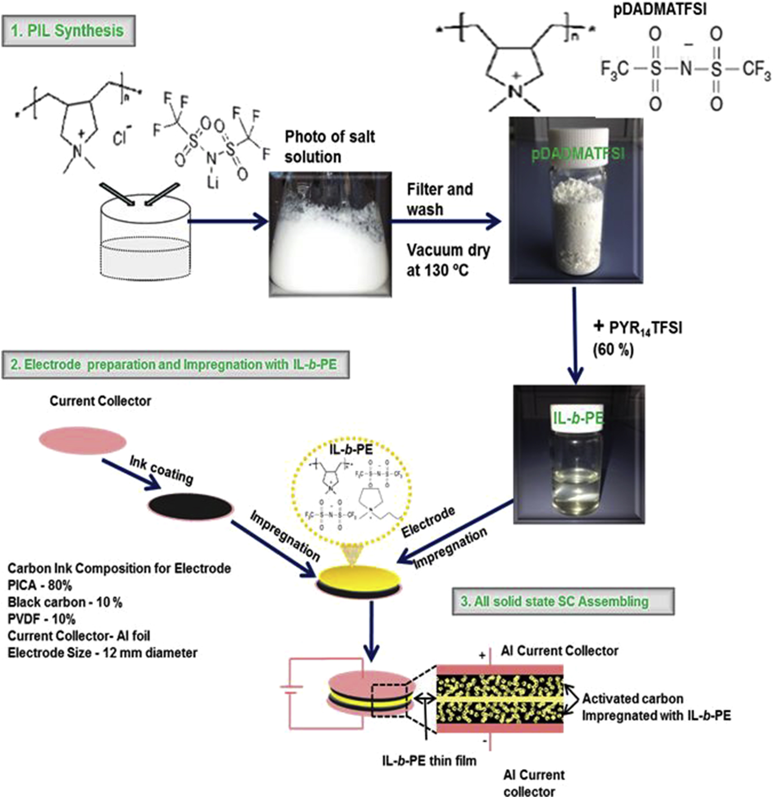

# Supercapacitors
超级电容器材料、器件与表征

## READING…  
1. [2015] [All-solid state supercapacitors operating at 3.5 V by using ionic liquid based polymer electrolytes  采用离子液体聚合物电解质在3.5 V下工作的全固态超级电容器](All-solid-state-supercapacitors-operating-at-3.5V-by-using-ionic-liquid-based-polymer-electrolytes/All-solid-state-supercapacitors-operating-at-3.5V-by-using-ionic-liquid-based-polymer-electrolytes.md)  
   - 基于吡咯烷基PIL（聚（二烯丙基二甲基铵）双（三氟甲磺酰基）酰亚胺（pDADMTFSI））和其相应的离子液体单体的二元混合物的全固态超级电容器的性能。IL：PIL的重量比为60:40。
   - 制备过程：  
       
   - 具有吡咯烷阳离子和TFSI阴离子的PIL和IL的选择基于两种离子的宽电化学稳定性窗口。Pica碳是商业活性炭，其在电极制备中用作活性材料。还研究了含有不同比例的IL-b-PE的全固态超级电容器对电极活性质量的电化学性能。
   - 将作为活性材料的PICA碳，炭黑和PVDF（80:10:10）与NMP混合并置于以250rpm运行30分钟的球磨研磨机中以获得均匀的碳墨。

2. [2019] [A highly adhesive PIL/IL gel polymer electrolyte for use in flexible solid state supercapacitors 高粘性的PIL/IL凝胶聚合物电解质，用于柔性固态超级电容器](A-highly-adhesive-PIL-IL-gel-polymer-electrolyte-for-use-in-flexible-solid-state-supercapacitors/A-highly-adhesive-PIL-IL-gel-polymer-electrolyte-for-use-in-flexible-solid-state-supercapacitors.md)
   - 新型凝胶聚合物电解质（GPE）由聚（1-乙烯基-3-丙基咪唑双（氟磺酰基）酰亚胺）（聚（VPIFSI））与市售离子液体1-乙基-3-甲基咪唑鎓双（氟磺酰基）酰亚胺（EMIFSI）混合。
      
   - 对几个PIL/IL-GPEs进行了电化学表征。使用电化学阻抗谱，循环伏安法和恒流充电/放电技术评估了PIL/IL-GPE（IL50％wt）对柔性固态超级电容器性能的影响。讨论了在使用不同条件和折叠角的循环过程中离子对器件中双电层形成的影响。
   - 胶粘剂PIL/IL-GPE的特性，例如高电导率，PIL基质与IL液相之间的良好相互作用,可防止泄漏（有助于提高安全性）。

3. [2019] [High temperature solid-state supercapacitor designed with ionogel electrolyte 采用离子凝胶电解质设计的高温固态超级电容器](High-temperature-solid-state-supercapacitor-designed-with-ionogel-electrolyte/High-temperature-solid-state-supercapacitor-designed-with-ionogel-electrolyte.md)  
   - 离子凝胶由EMImTFSI，四甲氧基硅烷（TMOS），二甲基二甲氧基硅烷（DMDMS）制成的溶胶获得的。关键点在于，DMDMS可为二氧化硅基质提供柔韧性，并能在碳电极上直接制造无裂纹的离子凝胶。
   - 该离子凝胶具有高离子电导率和良好的机械性能，因此适合在高温全固态EDLC中实施。这些基于离子凝胶的EDLC可以在高达3 V的条件下工作，证明在100°C时具有很高的循环稳定性（25000个循环）以及高比电容。

4. []