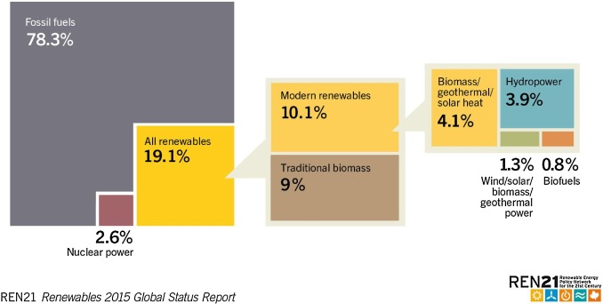
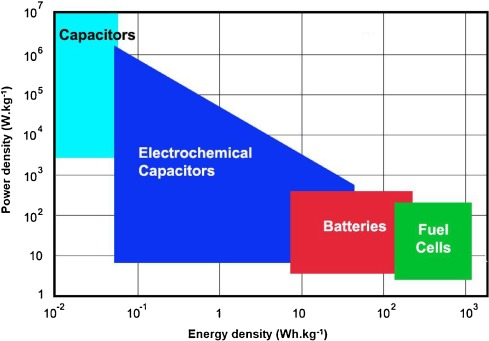
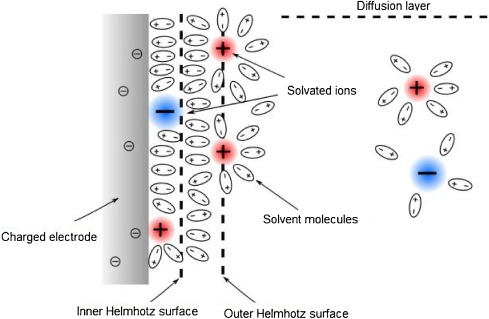

## Supercapacitors: Properties and applications

> Journal of Energy Storage, Volume 17, June 2018, Pages 224-227
> [doi.org/10.1016/j.est.2018.03.012](doi.org/10.1016/j.est.2018.03.012)
> Key Words: Supercapacitor, Energy, Storage, Pseudo-supercapacitor, Hybrid-supercapacitor, Lithium

### Highlights
> Supercapacitors have interesting properties in relation to storing electric energy, as an alternative to batteries.  
> Supercapacitors can handle very high current rates.  
> Supercapacitors have low energy density to unit weight and volume.  
> The price per unit of energy (kWh) is extremely high.

### Abstract
Energy accumulation and storage is one of the most important topics in our times. This paper presents the topic of supercapacitors (SC) as energy storage devices. Supercapacitors represent the alternative to common electrochemical batteries, mainly to widely spread lithium-ion batteries. By physical mechanism and operation principle, supercapacitors are closer to batteries than to capacitors. Their properties are somewhere between batteries and capacitors. They are able to quickly accommodate large amounts of energy (smaller than in the case of batteries – lower energy density from weight and volume point of view) and their charging response is slower than in the case of ceramic capacitors. The most common type of supercapacitors is electrical double layer capacitor (EDLC). Other types of supercapacitors are lithium-ion hybrid supercapacitors and pseudo-supercapacitors. The EDLC type is using a dielectric layer on the electrode − electrolyte interphase to storage of the energy. It uses an electrostatic mechanism of energy storage. The other two types of supercapacitors operate with electrochemical redox reactions and the energy is stored in chemical bonds of chemical materials. This paper provides a brief introduction to the supercapacitor field of knowledge.  
能量积累和储存是我们时代最重要的话题之一。本文介绍了超级电容器（SC）作为储能装置的主题。超级电容器代表了普通电化学电池的替代品，主要用于广泛传播的锂离子电池。通过物理机制和工作原理，超级电容器更接近电池而不是电容器。它们的特性介于电池和电容之间。它们能够快速容纳大量能量（小于电池的情况 -从重量和体积的角度来看能量密度较低），并且它们的充电响应比陶瓷电容器慢。最常见的超级电容器类型是双电层电容器（EDLC）。其他类型的超级电容器是锂离子混合超级电容器和伪超级电容器。 EDLC类型是在电极上使用介电层 -电解质中间相以储存能量。它使用静电储能机制。另外两种类型的超级电容器通过电化学氧化还原反应进行操作，并且能量存储在化学材料的化学键中。本文简要介绍了超级电容器的知识领域。

Limited sources of fossil fuels along with growing population and technology development put the mankind in front of an energy problem. Increasing pollution forces us to think about energy and the approach to energy management. There are two main types of energy sources, fully controllable power plants (nuclear power stations, incineration plants, fossil fuels, biomass, geothermal) and renewable energy sources, which are non-dispatchable (wind and solar energy).  
有限的化石燃料来源以及不断增长的人口和技术发展使人类面临能源问题。不断增加的污染迫使我们考虑能源和能源管理方法。有两种主要类型的能源，完全可控的发电厂（核电站，焚烧厂，化石燃料，生物质，地热）和可再生能源，它们是不可调度的（风能和太阳能）。

The world human population cannot use only renewable energy sources, at least in the near future. The share of renewable energy among other types of energy sources in 2015 is shown in Fig1 In the ideal case, renewable energy should cover 100% of world energy consumption, but it is only a theoretical idea that is not possible to be achieved. We should however increase the proportion of renewable energy sources in the world energy production as fast as possible.  
世界人口不能仅使用可再生能源，至少在不久的将来。 2015年可再生能源在其他类型能源中的份额如图1所示。在理想情况下，可再生能源应覆盖世界能源消耗的100％，但这只是一个无法实现的理论思路。 。但是，我们应该尽快提高世界能源生产中可再生能源的比例。

Fig. 1. Estimated renewable energy share of global final energy consumption [1].  
图1.全球最终能源消耗的可再生能源估计份额[1]。

Energy from renewable energy sources needs to be (due to its non-dispatchability) stored and used when needed. Energy storage and accumulation is the key part of renewable energy sources utilization. Use of batteries or special hydropower plants is the only way how can we today store the energy from renewable energy sources. There are other experimental alternatives − storing energy in superconducting magnetic energy storage systems (SMES), which store it in a magnetic field created by the flow of current in a superconducting coil that has been cryogenically cooled to a temperature below its superconducting critical temperature. There are also other energy storage systems still in the phase of basic research, so they cannot be considered as regular energy storage systems. Another important step to decreasing pollution and keeping sustainable development of population is reducing emissions produced by combustion engine vehicles and replacing them with electric vehicles. Autonomy electric vehicles, which do not have connection to the electrical grid, also need to store electric energy in batteries. Using batteries, especially lithium-ion batteries, is a widely discussed and technologically developed topic.  
来自可再生能源的能量需要（由于其不可调度性）在需要时存储和使用。能量储存和积累是可再生能源利用的关键部分。使用电池或特殊水电站是我们今天如何储存可再生能源的唯一途径。还有其他实验替代方案 -将能量存储在超导磁能存储系统（SMES）中，该系统将其存储在由超导线圈中的电流流动产生的磁场中，该超导线圈被低温冷却至低于其超导临界温度的温度。还有其他储能系统仍处于基础研究阶段，因此不能将其视为常规储能系统。减少污染和保持人口可持续发展的另一个重要步骤是减少内燃机车辆产生的排放并用电动汽车取而代之。没有连接到电网的自治电动车辆也需要将电能存储在电池中。使用电池，尤其是锂离子电池，是一个广泛讨论和技术发展的主题。

Supercapacitors could be considered as an alternative to conventional batteries for electric vehicles. This paper is related to supercapacitors, it provides their brief description, operation principles, types and recent development.  
超级电容器可以被认为是电动汽车的传统电池的替代品。本文涉及超级电容器，它提供了它们的简要描述，操作原理，类型和最近的发展。

Electrochemical capacitors, also named supercapacitors or ultracapacitors, are electrical components that are able to store and accommodate certain amounts of energy. The development of supercapacitors started in the 50 s of the 20th century. First experiments started between 50 s and 70 s and were conducted by US companies General Electric (GE) and Standard Oil of Ohio (SOHIO). These first electrochemical supercapacitors reached the capacity around 1F. This type of supercapacitors was patented in 1971 by SOHIO. The first supercapacitor named “Gold Cap” was released to the commercial market in 1982 by Panasonic and had high equivalent series resistance (ESR). In 1982, first electric double-layer capacitor (EDLC) supercapacitor was developed for military purposes by the Pinnacle Research Institute (PRI). This first EDLC supercapacitor already had a low ESR. After ten years, in 1992, Maxwell Laboratories introduced to the commercial market a wide range of EDLC supercapacitors with low ESR named “BoostCap” with nominal capacity of 1 kF. Since 2007, the development of novel hybrid-supercapacitors took place. This kind of supercapacitors should reach higher nominal voltage along with higher volumetric and gravimetric energy density than conventional EDLC supercapacitors. Most of today’s supercapacitors have capacity over several thousands Farads and can provide charge-discharge currents in the range from tenths to hundredths of Amperes. Their main advantage from the application point of view is extremely high current (in comparison to batteries) that they are able to operate with. Thanks to this characteristic property, supercapacitors fill the void gap among energy storage devices between batteries (accumulators) and common capacitors (see Fig. 2 below).  
电化学电容器，也称为超级电容器或超级电容器，是能够存储和容纳一定量能量的电子部件。超级电容器的发展始于20世纪50年代。第一次实验开始于50至70年代，由美国通用电气公司（GE）和俄亥俄州标准石油公司（SOHIO）进行。这些第一电化学超级电容器达到约1F的容量。这种超级电容器于1971年由SOHIO获得专利。第一款名为“Gold Cap”的超级电容器于1982年由Panasonic发布到商业市场，具有高等效串联电阻（ESR）。1982年，第一个双电层电容器（EDLC）超级电容器由Pinnacle研究所（PRI）开发用于军事目的。这第一款EDLC超级电容器的ESR已经很低了。十年后，在1992年，Maxwell Laboratories向商业市场推出了各种具有低ESR的EDLC超级电容器，名为“BoostCap”，额定容量为1kF。自2007年以来，开发了新型混合超级电容器。与传统的EDLC超级电容器相比，这种超级电容器应该达到更高的标称电压以及更高的体积和重量能量密度。今天的大多数超级电容器具有超过几千法拉的容量，并且可以提供从十分之一到百分之一安培的充放电电流。从应用的角度来看，它们的主要优点是能够操作的极高电流（与电池相比）。由于这种特性，超级电容器填充了电池（蓄电池）和普通电容器之间的能量存储装置之间的空隙（参见下面的图2）。

Fig. 2. Ragone chart: Power density as a function of energy density for various energy devices [2].  
图2. Ragone图：功率密度与各种能量设备的能量密度的函数关系[2]。

Supercapacitors are used in applications, where is the need to store or release huge amount of energy in a very short time. Nowadays, the supercapacitors are used primarily in Hybrid Electric Vehicles (HEV), Electric Vehicles (EV) and Fuel Cell Vehicles (FCV) like passenger cars, trains, trolleybuses. Another area of supercapacitors’ use are electronic devices as Uninterruptible Power Supplies (UPS) and volatile memory backups in PCs. Third area of use are energy harvesting systems, solar arrays or wind turbines, where supercapacitors play a supplementary role next to conventional batteries [[1], [2], [3], [4], [5], [6], [7], [8], [9], [10], [11], [12], [13], [14]].  
超级电容器用于应用中，需要在很短的时间内存储或释放大量能量。如今，超级电容器主要用于混合动力电动汽车（HEV），电动汽车（EV）和燃料电池汽车（FCV），如乘用车，火车，无轨电车。超级电容器使用的另一个领域是电子设备，如不间断电源（UPS）和PC中的易失性存储器备份。第三个使用领域是能量收集系统，太阳能电池阵列或风力涡轮机，其中超级电容器在传统电池旁边起辅助作用[[1]，[2]，[3]，[4]，[5]，[6]， [7]，[8]，[9]，[10]，[11]，[12]，[13]，[14]]。

Especially the application of supercapacitors in automotive industry brings many advantages. Supercapacitors can be used to increase the efficiency of hybrid electric vehicles in several ways. Today’s hybrid vehicles typically turn off the engine completely when the car stops, and then very efficiently start it again using energy stored in supercapacitors. There are over 600 thousands HEVs that use supercapacitors in their stop-start systems. Some supercapacitor manufacturers designed replacements for conventional vehicle batteries using supercapacitors connected across a smaller lead acid battery. The concept of their application is in the moments when the power demand peaks, such as starting a car, and they decrease the overall energy consumption from the batteries. Batteries last much longer when the discharge is small and steady. Supercapacitors in this “hybrid lead-acid battery” configuration essentially smooth out the energy demands on the battery.  
特别是超级电容器在汽车工业中的应用带来了许多优点。超级电容器可用于以多种方式提高混合动力电动车辆的效率。今天的混合动力汽车通常在汽车停止时完全关闭发动机，然后使用存储在超级电容器中的能量再次高效地启动它。在他们的停止启动系统中有超过600,000个HEV使用超级电容器。一些超级电容器制造商使用连接在较小铅酸电池上的超级电容器设计了传统车辆电池的替代品。它们的应用概念是在电力需求达到峰值的时刻，例如启动汽车，并且它们降低了电池的总能耗。当放电小且稳定时，电池持续更长时间。这种“混合铅酸蓄电池”配置中的超级电容器基本上消除了对电池的能量需求。

### Supercapacitor categories and operation principles
Superconductors can be divided into three basic categories according to the energy storage principle. It should be noted that the supercapacitors belong into the category of wet electrolytic capacitors using a liquid electrolyte that contains ions (charged complexes) to ensure charge transport. The first category includes Electric Double-Layer Capacitors or so-called EDLC Supercapacitors. This type of supercapacitor is the most common type and represents majority on the commercial market. The EDLC supercapacitors use liquid electrolyte. Most of these electrolytes use aprotic solvents like propylene carbonate (PC), diethyl carbonate (DEC), dimethyl carbonate (DME) or ethylene carbonate (EC), which include dissolved salts like tetraethylammonium tetrafluoroborate (TEABF4) or lithium hexafluoroarsenate (LiAsF6). As electrolytes are used (experimentally) ionic liquids as triethylsulfonium bis(trifluoromethylsulfonyl) imide or 1-ethyl-3-methylimdazolium thiocyanate and a wide range of other ionic liquids. These EDLC supercapacitors use electrostatic interaction to accumulate energy in Helmholtz double layers on the phase interface between the surface of the electrodes and the electrolyte. Double-layer capacitance is arising from potential-dependence of the surface energy stored electrostatically at the interface of capacitor electrodes. In this type of supercapacitors, there is no electron exchange and no redox reaction and the energy is stored non-faradaically. The key point to obtain an extremely high capacity is the large surface of the electrodes and the Helmholtz layer thickness. EDLC supercapacitors possess good durability and cycleability in millions of cycles. As an electrode material for EDLC supercapacitors, activated carbon (AC) is widely used, where its large specific surface area is advantageous.  
根据储能原理，超导体可分为三个基本类别。应该注意的是，超级电容器属于使用含有离子（带电络合物）的液体电解质以确保电荷传输的湿式电解电容器类别。第一类包括双电层电容器或所谓的EDLC超级电容器。这种类型的超级电容器是最常见的类型，并且在商业市场上占多数。 EDLC超级电容器使用液体电解质。大多数这些电解质使用非质子溶剂，如碳酸亚丙酯（PC），碳酸二乙酯（DEC），碳酸二甲酯（DME）或碳酸亚乙酯（EC），其包括溶解的盐，如四乙基铵四氟硼酸盐（TEABF4）或六氟砷酸锂（LiAsF6）。由于电解质（实验上）使用离子液体如三乙基锍双（三氟甲基磺酰基）酰亚胺或1-乙基-3-甲基咪唑硫氰酸盐和各种其他离子液体。这些EDLC超级电容器使用静电相互作用在电极表面和电解质之间的相界面上的亥姆霍兹双层中积聚能量。双层电容是由静电存储在电容器电极界面处的表面能的电位依赖性引起的。在这种类型的超级电容器中，没有电子交换并且没有氧化还原反应，并且能量以非法拉第的方式存储。获得极高容量的关键是电极的大表面和*亥姆霍兹层厚度*。 EDLC超级电容器具有数百万次循环的良好耐用性和循环性。作为EDLC超级电容器的电极材料，广泛使用活性炭（AC），其中大的比表面积是有利的。

A model of Helmholtz double layer is shown in Fig. 3.

Fig. 3. Diagram of the Helmholtz double layer on a liquid-solid (electrolyte-electrode) interface.  
图3.液 -固（电解质 -电极）界面上的亥姆霍兹双层图。

The second category represents so-called pseudo-supercapacitors or faradaic supercapacitors. This kind of supercapacitors is used much less frequently than EDLC supercapacitors and is commercially offered only by a few companies. By operation principle, they are closer to batteries than to capacitors. Pseudocapacitance is a phenomenon, where electrode materials intermediate electron transfer and undergo redox reactions. The pseudocapacitance arises at the electrode surfaces, where faradaic reactions origin, and the reactions involving the passage of energy across the double layer, similar to battery charging or discharging, but capacitance grows due to the special relation that can be expressed as the amount of energy accepted (Δq) and the change of potential (ΔV), so that the derivative d(Δq)/d(ΔV) or dq/dV is equivalent to the capacitance C. During charge and discharge, there occurs a redox reaction (arising from the bonds in the compounds) and energy transfer between electrolyte and electrode. Energy is not stored in the “dielectric” layer, but is represented by the energy of molecule bonds. The disadvantage of these systems is the principle itself, because during charging and discharging, the electrodes are stressed and degrade faster, compared to the electrostatic storage principle. It is connected with increasing the internal resistance of supercapacitors. Pseudosupercapacitors have both electrodes made by pseudocapacitive materials like ruthenium oxide (RuO2) or manganese dioxide (MnO2). The stability and cycleability are lower than in the case of EDLC supercapacitors along with lower charging efficiency and longer time response (lower discharge rate).  
第二类代表所谓的伪超级电容器或法拉第超级电容器。这种超级电容器的使用频率远低于EDLC超级电容器，并且仅由少数公司商业提供。根据工作原理，它们更接近电池而不是电容器。伪电容是一种现象，其中电极材料中间电子转移并经历氧化还原反应。赝电容出现在电极表面，其中法拉第反应起源，并且涉及能量通过双层的反应，类似于电池充电或放电，但电容由于特殊关系而增长，可以表示为能量的量接受（Δq）和电位变化（ΔV），使得导数d（Δq）/d（ΔV）或dq /dV等于电容C.在充电和放电期间，发生氧化还原反应（由化合物中的键和电解质与电极之间的能量转移。能量不存储在“电介质”层中，而是由分子键的能量表示。这些系统的缺点在于原理本身，因为在充电和放电期间，与静电存储原理相比，电极受到应力并且降解得更快。它与增加超级电容器的内阻有关。伪超级电容器具有由赝电容材料制成的两个电极，例如氧化钌（RuO2）或二氧化锰（MnO2）。稳定性和循环性低于EDLC超级电容器的情况以及较低的充电效率和较长的时间响应（较低的放电速率）。

The third, last type of supercapacitors, is called hybrid supercapacitors. It is the newest type of supercapacitors. This most advanced supercapacitor combines both previous supercapacitor types, the EDLC and pseudo-supercapacitors. The main advantage is higher volumetric and gravimetric energy density along with the capability to provide high currents. Due to faradaic reaction that occurs on the negative electrode, which is typically made from pseudocapacitive electrode material, hybrid supercapacitors possess higher energy density. The positive electrode is typically made from activated carbon that stores electrostatic energy in the double layer on the electrode surface. Thanks to the electrostatic interaction between charge carriers and electrode surface on positive electrode side, hybrid supercapacitors can deliver high currents. Hybrid supercapacitors are from the construction and operation point of view close to lithium-ion batteries. Nowadays, there are no hybrid supercapacitors commercially available on the market, but they are investigated in laboratory conditions. Table 1 summarizes and compares supercapacitors with other types of electrochemical energy sources [[14], [15], [16], [17], [18], [19], [20], [21], [22], [23], [24], [25], [26], [27], [28], [29], [30], [31], [32], [33]].  
第三种，最后一种超级电容器，称为混合超级电容器。它是最新型的超级电容器。这种最先进的超级电容器结合了以前的超级电容器类型，EDLC和伪超级电容器。主要优点是更高的体积和重量能量密度以及提供高电流的能力。由于在负电极上发生的法拉第反应（通常由赝电容电极材料制成），混合超级电容器具有更高的能量密度。正电极通常由活性炭制成，其在电极表面上的双层中存储静电能量。由于电荷载体和正电极侧的电极表面之间的静电相互作用，混合超级电容器可以提供高电流。混合型超级电容器从构造和操作的角度来看都接近锂离子电池。如今，市场上没有商用的混合超级电容器，但是它们在实验室条件下进行了研究。表1总结并比较了超级电容器与其他类型的电化学能源[[14]，[15]，[16]，[17]，[18]，[19]，[20]，[21]，[22]， [23]，[24]，[25]，[26]，[27]，[28]，[29]，[30]，[31]，[32]，[33]]。

Attribute | EDLC SC | Pseudo SC | Hybrid SC | Lithium-ion battery
:-: | :-: | :-: | :-: | :-:
Charge time [s] | 1–10 | 1–10 | 100 | 600
Cycle life | 1000000 | 100000 | 500000 | 500
Specific energy [$Wh.kg^{−1}$] | 3–5 | 10 | 180 | 250
Cost per kWh [USD] | ∼10 000 | ∼10 000 | Data not available | ∼140
Operating temperature [°C] | −40 to 65 | −40 to 65 | −40 to 65 | −20 to 60
Self discharge per month [%] | 60 | 60 | Data not available | 4
Type of electrolyte | protic or Protic | Protic | Aprotic | Aprotic

Table 1. Summarization and comparison of important attributes [[1], [2], [3], [4], [5], [6], [7], [8], [9], [10], [11], [12], [13], [14], [15], [16]].

Electrolytes used in supercapacitors can be divided into two groups − aprotic and protic electrolytes (see Table 1 above). Each one has different benefits and limitations. Protic solvents based on water are more environmentally friendly, safe and offer higher conductivity. Aprotic electrolytes increase the working voltage window compared to that of a water soluble electrolyte, hence producing a higher energy density. The most widely used protic electrolyte is potassium hydroxide (KOH) or sodium hydroxide (NaOH) and sulfuric acid (H2SO4) electrolyte. Among most widely used aprotic electrolytes are lithium salts lithium hexafluorophosphate (LiPF6), lithium perchlorate (LiClO4) and lithium tetrafluoroborate (LiBF4) dissolved in a mixture of solvents such as dimethyl carbonate (DMC), diethyl carbonate (DEC) and ethylene carbonate (EC). The protic electrolytes possess higher conductivity, they exhibit higher fire safety, lower price and are more environmentally friendly than the aprotic ones. On the other side the protic solvents possess, significantly narrower working potential window.  
超级电容器中使用的电解质可分为两组-非质子电解质和质子电解质（见上表1）。每个人都有不同的好处和限制。基于水的质子溶剂更环保，更安全并且具有更高的导电性。与水溶性电解质相比，非质子电解质增加了工作电压窗口，因此产生更高的能量密度。最广泛使用的质子电解质是氢氧化钾（KOH）或氢氧化钠（NaOH）和硫酸（H2SO4）电解质。在最广泛使用的非质子电解质中，锂盐是六氟磷酸锂（LiPF6），高氯酸锂（LiClO4）和四氟硼酸锂（LiBF4）溶解在溶剂混合物中，如碳酸二甲酯（DMC），碳酸二乙酯（DEC）和碳酸亚乙酯（EC） ）。质子电解质具有更高的导电性，它们具有更高的防火安全性，更低的价格，并且比非质子电解质更环保。另一方面，质子溶剂具有明显更窄的工作电位窗口。

### Conclusions
Supercapacitors represent an interesting alternative to conventional batteries. There are new types of hybrid supercapacitors based on the established lithium-ion technology. These hybrid lithium-ion supercapacitors already have a higher energy density. Today, these hybrid lithium-ion supercapacitors can find use in applications, where only conventional lithium-ion batteries were used so far. The use of supercapacitors in many applications was limited by their low energy density and high price (SC $10 000 kWh, Li-ion $240 kWh). New generation of supercapacitors possess a similar energy and power density (EDLC SC 6 Wh kg−1 Li-ion 250 Wh kg−1, Hybrid SC around 180 Wh kg−1) as lithium-ion batteries and are able to deliver considerably higher currents than lithium-ion batteries [30].  
超级电容器代表了传统电池的有趣替代品。基于已建立的锂离子技术，有新型混合超级电容器。这些混合锂离子超级电容器已具有更高的能量密度。如今，这些混合锂离子超级电容器可用于迄今仅使用传统锂离子电池的应用中。在许多应用中使用超级电容器受限于它们的低能量密度和高价格（SC $ 10,000kWh，Li-ion 240kWh）。新一代超级电容器具有相似的能量和功率密度（EDLC SC 6Whkg-1锂离子250Whkg-1，混合SC约180Whkg-1）作为锂离子电池，能够提供更高的电流比锂离子电池[30]。

As a follow-up on this issue, we are performing a series of experiments dealing with hybrid lithium-ion supercapacitors based on our experience in the field of lithium-ion batteries, especially the pre-lithiation method, which is a very important element in the hybrid lithium-ion supercapacitor technology.  
作为此问题的后续行动，我们根据我们在锂离子电池领域的经验，特别是预锂化方法，进行了一系列处理混合锂离子超级电容器的实验，这是一个非常重要的元素。混合锂离子超级电容器技术。